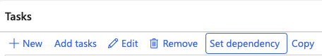

# Set checklist task dependencies

Dependencies prevent a task from being completed until a prerequisite task is finished first — for example, setting up a laptop depends on the Active Directory account being created.

1. Open the checklist

   Go to **Modules ▸ Human Resources ▸ Task Management ▸ Onboarding checklists**, select the relevant checklist, and click **Edit**.

2. Select the task to configure

   Click on the task that should be blocked until another task is completed first.

3. Add a dependency

   Click **Set Dependency** and select the task that must be completed beforehand. A task can have multiple dependencies.

   

4. Save

   Click **Save** to apply the configuration.

   In ESS, employees will see the dependent task in their list but it is locked until all dependency tasks are complete. The task detail view shows which tasks are blocking progress and who is responsible for completing them.
