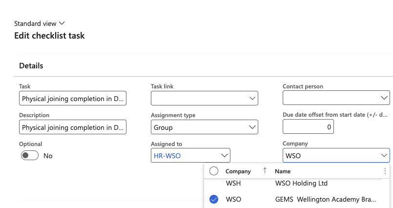

# Configure a school-specific checklist task

Tasks within an onboarding checklist can be scoped to specific legal entities (schools), so only relevant tasks appear for employees at each school. Tasks with no company restriction apply to all schools.

1. Open the onboarding checklist

   Go to **Modules ▸ Human Resources ▸ Task Management ▸ Onboarding checklists** and select the relevant checklist.

2. Select the task to scope

   Click the task you want to restrict to specific schools.

3. Set the applicable companies

   In the **Company** field, select one or more legal entities (schools) this task applies to. Employees onboarding at other schools will not see this task on their checklist.

   

4. Save

   Click **Save** to apply the change.
