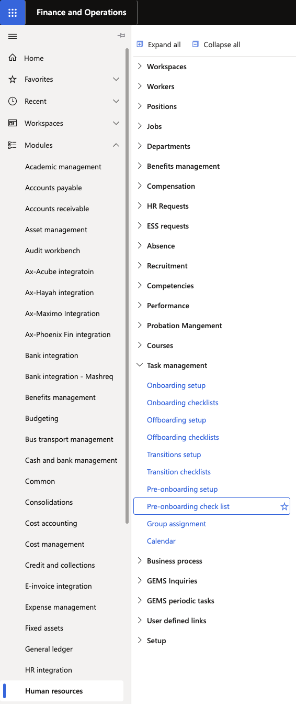
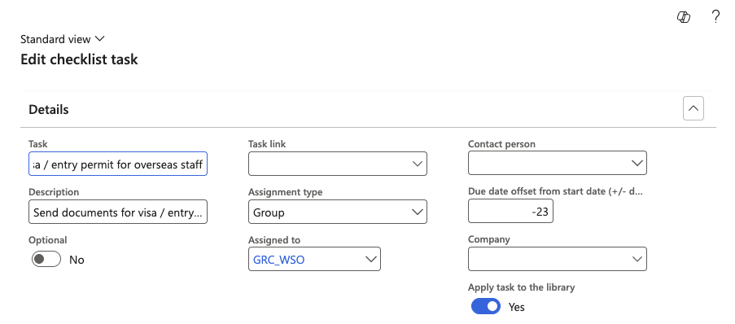

# Configure a pre-onboarding checklist

Pre-onboarding checklists define tasks that must be completed by HR and support teams *before* a new employee's start date — for example, collecting credentials or sending welcome documents. These checklists are assigned when the hire worker action is processed, and tasks are visible in both the D365 task management workspace and ESS.

Pre-onboarding checklists are configured separately from onboarding checklists. They follow the same structure but are scoped to tasks that occur before the employee joins.

1. Open Pre-onboarding checklists

   From the D365 navigation pane, go to **Modules ▸ Human Resources ▸ Task Management ▸ Pre-onboarding checklists**.

   

2. Select or create a checklist

   Select an existing checklist to modify, or click **New** to create one.

3. Edit the checklist

   Click **Edit** to enter edit mode. For each task, configure:

   - **Task name** and description
   - **Assigned to** — a specific person or a user group (see [Configure task user groups](./05-configure-task-user-groups.md) for group setup)
   - **Company** — the legal entity (school) this task applies to. Tasks with no company set apply to all legal entities.
   - **Offset date** — the number of days before the target date by which the task should be completed. When the checklist is assigned on a worker action, the system calculates individual task due dates automatically from this offset.

   

4. Set dependencies (optional)

   If a task should be blocked until another task is finished, scroll right to the **Dependency** column and select the prerequisite task. See [Set checklist task dependencies](./02-set-checklist-dependencies.md) for full steps.

5. Save

   Click **Save** to apply the configuration.
