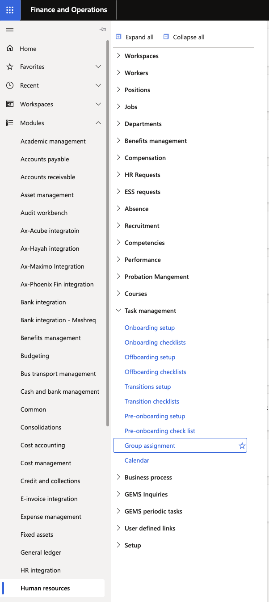
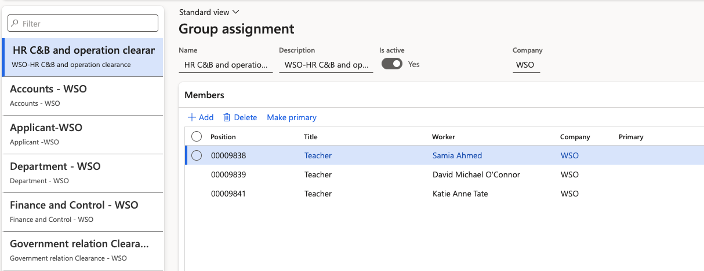

# Configure task user groups

User groups allow multiple employees to be assigned to a checklist task together. When any one member of the group completes the task, it is automatically marked complete and removed from the task lists of all other group members. The **Resolved By** column in the task management workspace records which group member completed the task.

This is useful for HR and admin teams where several people share responsibility for tasks such as collecting documents or setting up system access.

1. Open User Groups

   From the D365 navigation pane, go to **Modules ▸ Human Resources ▸ Task Management ▸ User Groups**.

   

2. Select or create a group

   Select an existing group to update, or click **New** to create a group. Give the group a meaningful name that reflects its role or school (for example, *WSO HR Pre-Onboarding Team*).

3. Add members

   In the group detail view, the employee list shows all available members filtered by legal entity. Use the available filters to narrow the list by position, job title, or name, then select the employees to add to the group.

   

4. Save

   Click **Save** to apply the group membership.

   Groups are scoped by legal entity — employees from other schools are not visible unless their legal entity context is switched. Assign this group to checklist tasks in the **Assigned To** field when configuring an onboarding or pre-onboarding checklist.
