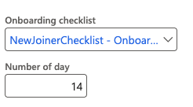

# Set onboarding parameters

The Human Resources parameters form controls which onboarding checklist is applied automatically when a hire worker action is completed, and how many days the new employee has to complete their onboarding tasks.

1. Open Human Resources parameters

   In D365, search for and open **Human Resources parameters**.

2. Go to the Recruitment tab

   Select the **Recruitment** tab.

3. Nominate the default onboarding checklist

   In the **Onboarding checklist** field, select the checklist to apply automatically when a hire worker action of the configured type is completed. Only one checklist can be nominated as the default.

4. Set the completion period

   In the **Number of days** field, enter the number of days the new employee has to complete their onboarding tasks from their start date.

   

5. Save

   Click **Save**.
