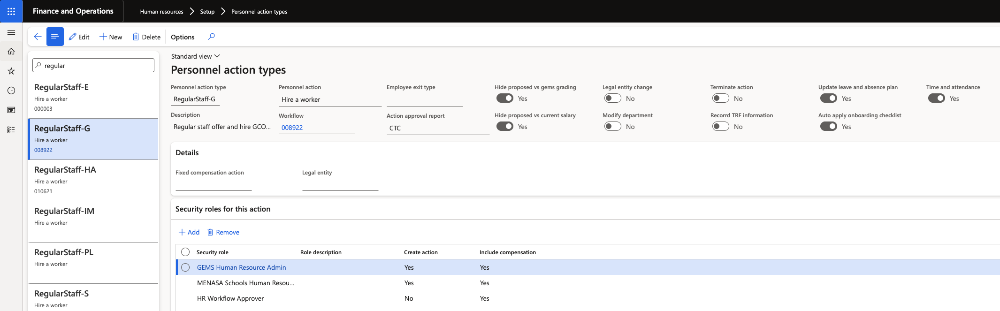

# Configure personnel action types for onboarding

The Personnel action types form controls which hire action types automatically trigger an onboarding checklist when a worker completes an action. Enable this flag on each relevant action type.

1. Open Personnel action types

   In D365, search for and open **Personnel action types**.

2. Locate the hire action type

   Filter or scroll to find the action type used for new hires — for example, *Regular*.

3. Enable the checklist flag

   Enable the **Auto apply onboarding checklist** flag for this action type. When a worker completes this action type, the system automatically applies the nominated onboarding checklist to the new employee record.

   

4. Save

   Click **Save**.

   Repeat for any additional action types that should trigger onboarding checklist assignment.
