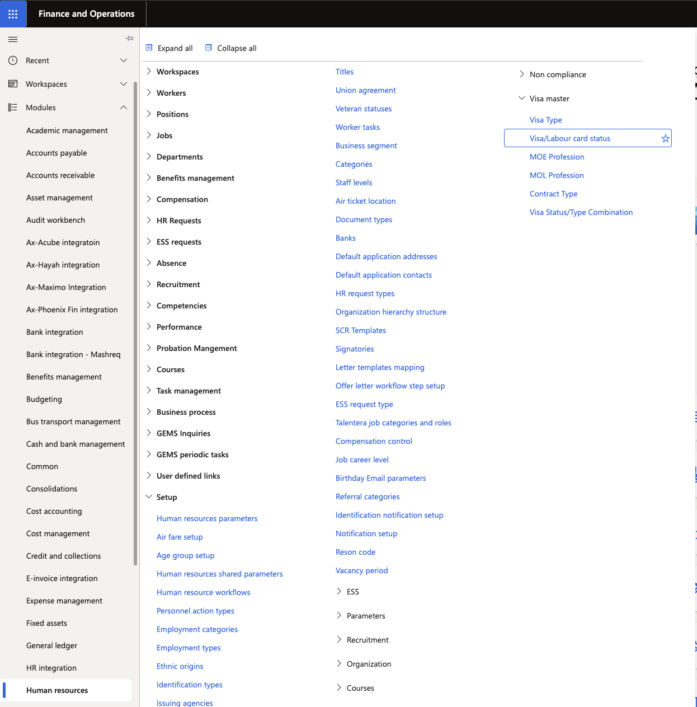
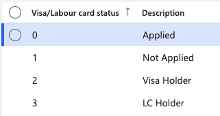

# Manage visa status setup

Visa statuses define the lifecycle stages used to track the progress of visa and labour card applications. These values are set during initial configuration and apply to all employee visa records.

1. Navigate to Visa/Labour card status

   From D365, go to **Human Resources** ▸ **Setup** ▸ **Visa master ▸ Visa/Labour card status**.

   

2. Review the configured statuses

   The list shows all available statuses. The default statuses are:

   | Status | Description |
   |---|---|
   | **Applied** | Application has been submitted to the relevant authority |
   | **Not Applied** | Application has not been submitted to the relevant authority |
   | **Visa Holder** | Visa holder |
   | **LC Holder** | Labour card holder |

   

3. Edit a status

   To modify an existing status, click **Edit** on the relevant row and make your changes.

4. Export the list

   Click **Export to Excel** to download the full list if needed.

5. Save

   Click **Save** when complete.
