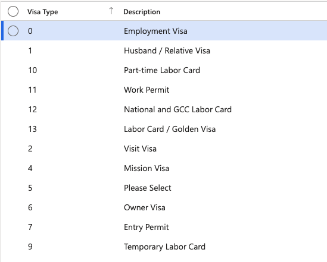
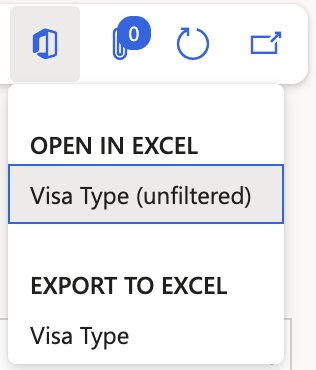

# Manage visa type setup

Visa types define the categories of visas available when recording employee visa information. These values were pre-loaded from the organisation's prior system during migration.

1. Navigate to Visa Type

   From D365, go to **Human Resources** ▸ **Setup** ▸ **Visa master ▸ Visa Type**. The full list of configured visa types is displayed.

   

2. Add a new visa type

   Click **New**, complete the required fields (type label and description), then click **Save**.

3. Export the list

   Click **Export to Excel** to download the list if needed.

   
