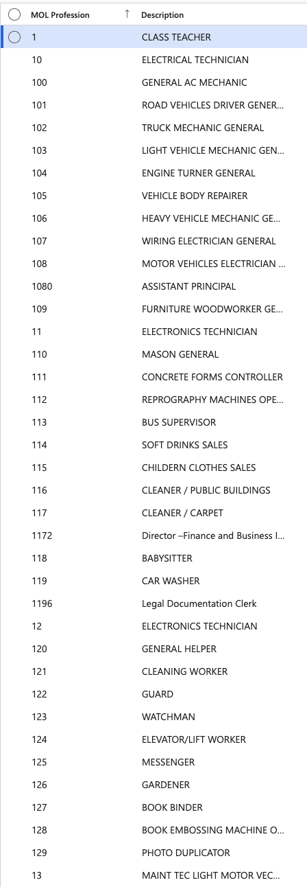

# Manage MOL professions

MOL (Ministry of Labour) professions define the occupational classifications required for labour regulatory compliance. All standard MOL professions are pre-loaded into the system.

1. Navigate to MOL Profession

   From D365, go to **Human Resources** ▸ **Setup** ▸ **Visa master ▸ MOL Profession**. The full list of MOL professions is displayed, including profession codes and descriptions. Descriptions are shown alongside codes in all dropdown selections to ensure clarity.

   

2. Add a new profession

   Click **New**, enter the profession code and description, then click **Save**.

3. Export the list

   Click **Export to Excel** to download the list if needed.
