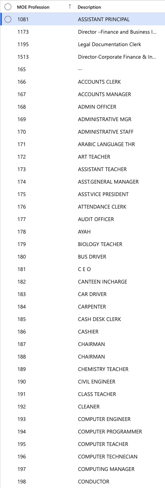

# Manage MOE professions

MOE (Ministry of Education) professions define the occupational classifications relevant to the education sector, used to categorise employee roles in line with Ministry requirements.

1. Navigate to MOE Profession

   From D365, go to **Human Resources ▸ Setup ▸ Visa Master ▸ MOE Profession**. The full list of configured professions is displayed.

   

2. Add a new profession

   Click **New**, complete the required fields, then click **Save**.

3. Export the list

   Click **Export to Excel** to download the list if needed.
