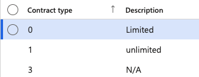

# Manage contract types

Contract types define the employment contract categories used when recording visa and employment information (for example: Full Time, Limited, Part Time). These values are configured once during initial setup and rarely change.

1. Navigate to Contract Type

   From D365, go to **Visa Master ▸ Contract Type**. The configured contract types are displayed — typically 5–6 values.

   

2. Add a new type

   Click **New**, complete the required fields, then click **Save**.
