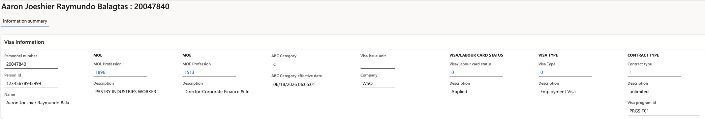

# View visa information for an employee

The visa information form captures all fields required for visa processing and regulatory compliance for an individual employee. This is typically completed by the HR or PRO team.

1. Navigate to the **Employee Visa Information** section.

   Follow the pathway: **Human resources ▸ Workers ▸ Employee Visa information**.

   

2. Select a record

   Click **New** to start a new visa entry.

3. View the completed fields

   Dropdown lists show profession descriptions alongside codes for clarity:

   - UID Number
   - Visa Type
   - Visa Programme
   - MOL Profession
   - MOE Profession
   - Working Unit
   - Labour Card details
   - ABC Category
   - Contract Type
     
   > **Note**: Once saved, expiry dates are monitored by the system. Alerts appear in the employee's ESS dashboard tiles and in the notification bell as the expiry approaches, based on the threshold configured for each document type.
