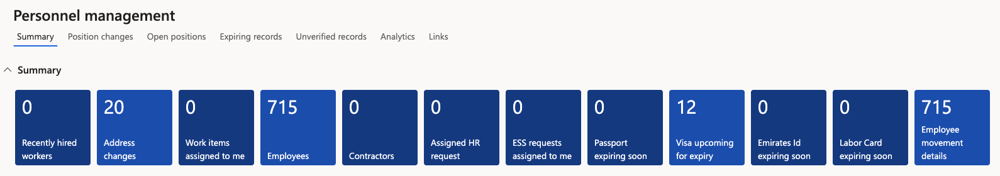
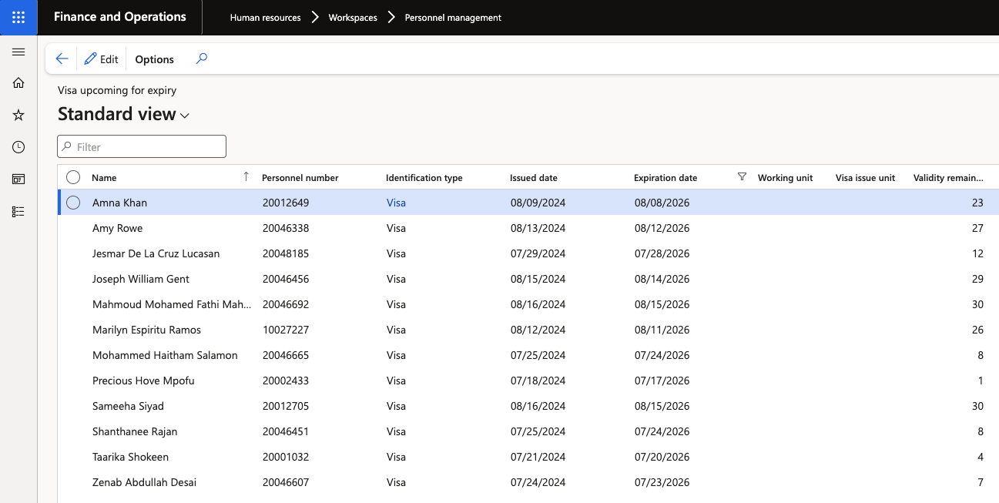

# View expiring records

The Expiring Records workspace gives HR and PRO teams a centralised view of all employee documents approaching or past their expiry dates.

1. Open Personnel Management

   Follow the pathway **Human resources ▸ Workspaces ▸ Personnel management**.

   

3. Click the tile

   Click the tile to open the full workspace view. Each record shows:
   - The employee's name and UID
   - The document type and expiry date
   - The number of days remaining

   Expiry thresholds — how far in advance an alert is triggered — are configured per document type in the system setup. For example, a passport alert may begin 50 days before expiry, displaying 49 days remaining.

   

4. Take action

   Review the list and contact or follow up with the relevant employees. Once a renewal has been processed, update the record in D365 accordingly.
