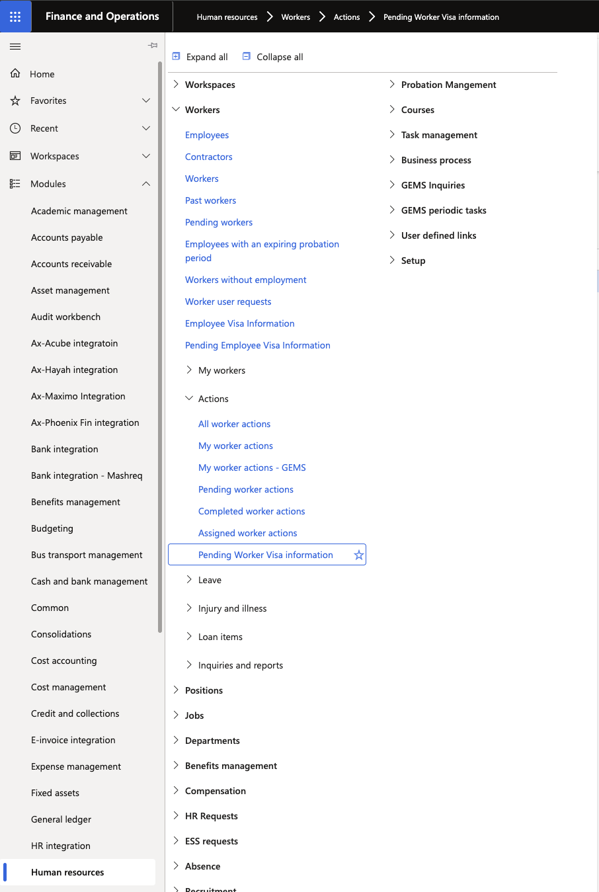
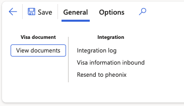

# Review pending worker visa information

When an applicant is hired through the recruitment process, any identification records added to the applicant record (such as passport or visa details) automatically carry over to the Pending Worker Visa Information form. The HR or PRO team uses this form to confirm documents are present and to complete additional visa-related fields before finalising the hire. When the worker's action is completed, all information is published to the employee's record.

1. Open Pending Worker Visa Information

   In D365, search for and open the **Pending Worker Visa Information** form.

   

2. Locate the worker record

   Find and open the record for the worker being hired. Records on this form correspond to pending worker actions that are not yet complete.

3. Confirm identification documents

   Click **View Documents** to view the identification records (such as a passport or visa) entered at the applicant stage. Confirm that the expected records are present. Attachments uploaded to the applicant record are also visible here.

   

4. Open the worker action

   Click on the **Action number** to open the corresponding worker action form.

5. Complete visa fields

   Click **Edit** and record the following fields as applicable. Default values configured in system setup will pre-populate where they apply:

   - **MOL Profession** — Ministry of Labour classification
   - **MOE Profession** — Ministry of Education classification (where applicable)
   - **Visa Issuing Unit** — the issuing authority (for example, WSO)
   - **Visa Labour Card Status** — select the status that applies to this worker
   - **Visa Type** — select the visa category (for example, Employment Visa A). The **ABC Category** field updates automatically based on the visa type selected.

   

6. Save

   Click **Save** to record the visa information on the worker action.

7. Complete the worker action

   Return to the worker action and complete it through the standard workflow (submit for approval and approve as required). Completing the worker action converts the pending worker to a confirmed employee record.

8. Verify the employee record

   Once the worker action is completed, confirm that the information has been published correctly:

   - Open the **Employee Visa Information** form and search for the new employee — visa fields and identification records should be present.
   - Open the employee's record in the **Human Resources** module and navigate to **Person Identifications** to confirm identification documents (for example, passport, visa) are listed.

   
