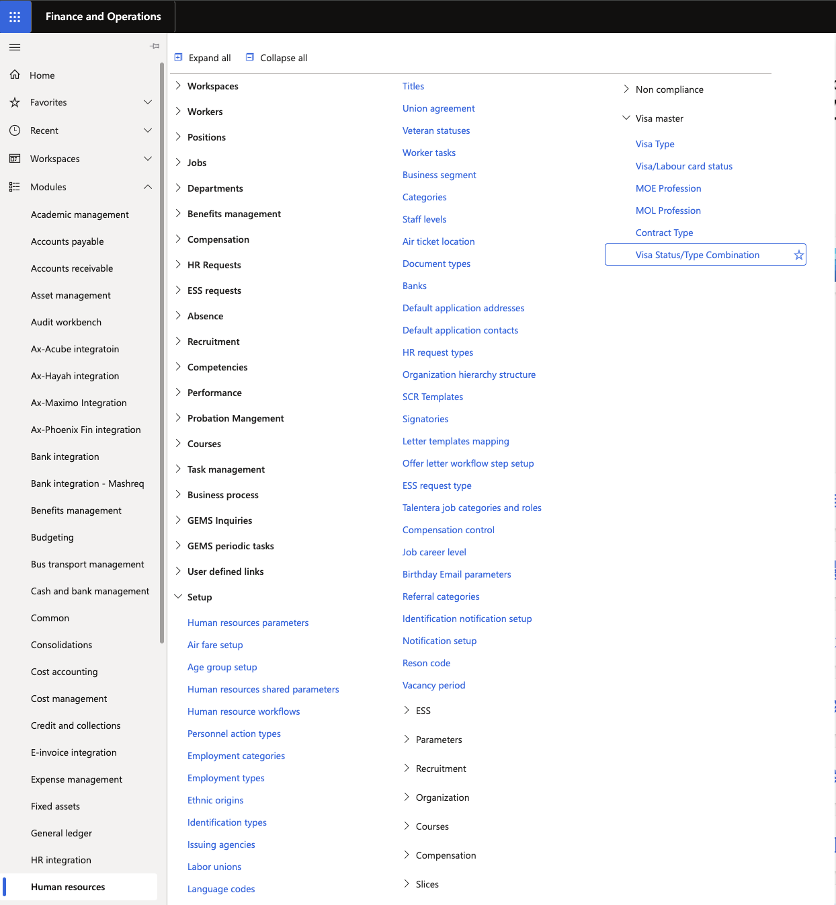
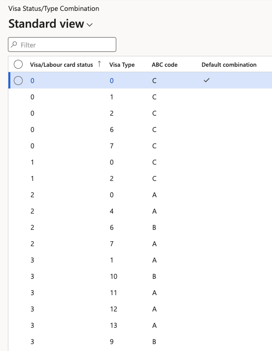

# Check Visa Status and Type

Use this table to determine what visa type is valid for an employee. For example, an employee with a visit visa cannot have a work visa status.

1. Navigate to Visa Status/Type Combination

   In D365, go to **Human resources ▸ Setup ▸ Visa master ▸Visa Status/Type Combination**.

   

2. View the table

   A table outlining the **Visa/Labour card status**, **Visa Type**, and **ABC code** will display automatically.

   
