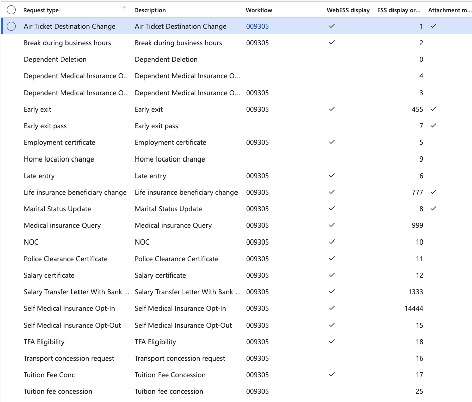
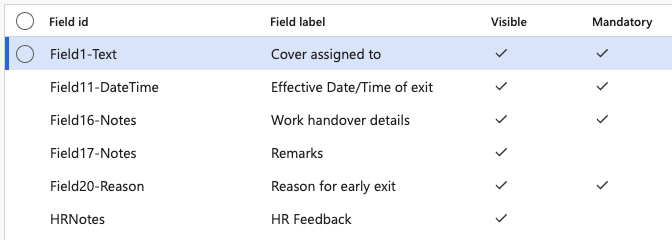

# Configure HR request types

Request types define what employees can request through the ESS portal, which fields appear on the submission form, what is required before submitting, and which approval workflow the request follows.

1. Open the HR request types form

   In D365, navigate to the **HR request types** form within the Human Resources module: **Human resources ▸ Setup ▸ HR request types**.

2. Select a request type

   Choose the request type to configure — for example, Police Clearance Certificate, Early Exit, or Home Location Change.

   

3. Configure the fields

   For each field on the request type, set:

   | Toggle | What it does |
   |---|---|
   | **WebESS display** | Shows the field on the employee's ESS submission form |
   | **Attachment mandatory** | Requires the employee to complete this field before submitting |

   The **Attachment** option is present on every request type by default — employees can always attach a file, so it does not appear in the field list.

   

4. Assign a workflow

   Select the approval **Workflow** to apply to this request type from the dropdown. If multiple workflows exist, choose the appropriate one for this type (for example, routing to the WSO HRBP approval group).

5. Control ESS visibility

   Toggle **Display on web ESS** to show or hide this request type in the employee portal. Request types that HR initiates internally should be set not to display in ESS.

6. Set the display order

   Enter a value in the **Input Order** field. Lower numbers appear first in the ESS request list (e.g., 1 = first). Assign a high number to push a request type to the bottom of the list.

7. Save

   Click **Save** to apply the configuration.
