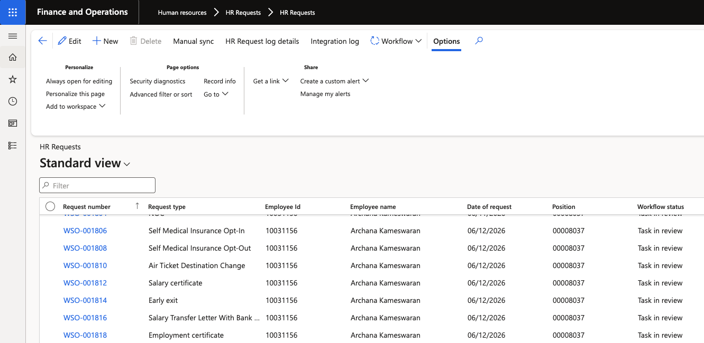
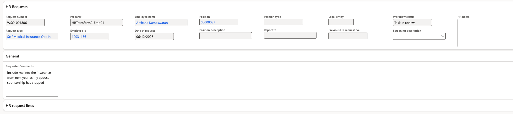

# Process an HR request

When an employee submits a request through ESS, it is routed to the HR team via the configured workflow. HR reviews the submission, provides feedback, and marks it complete.

1. Open the HR Request form

   In D365, navigate to the **HR Request** form within the Human Resources module. Click **Refresh** to load any new submissions. Each submitted request has a system-generated request number.

   

2. Open the request

   Click on a request to open its detail view. You can see:
   - The employee's submitted field values (e.g., destination, date, reason)
   - Any file the employee attached, which you can open or download

   

3. Review the submission

   Read through the employee's details and verify the request before taking action.

4. Enter HR Feedback

   In the **HR notes** field, enter your response or notes. This text is visible to the employee when they view their completed request in ESS.

5. Attach a document (optional)

   If you need to provide the employee with a document — such as an approval letter — click **Attach** to upload a file. The employee will be able to download it from their request in ESS.

6. Approve and complete the request

   Click **Approve** to approve the request, then click **Complete** to mark it as done and close the workflow.

   

   > **Note:** After completing a request there is typically a 3–5 minute delay before the updated status appears in ESS. The ESS cache refreshes on a 5-minute cycle — this is by design.
