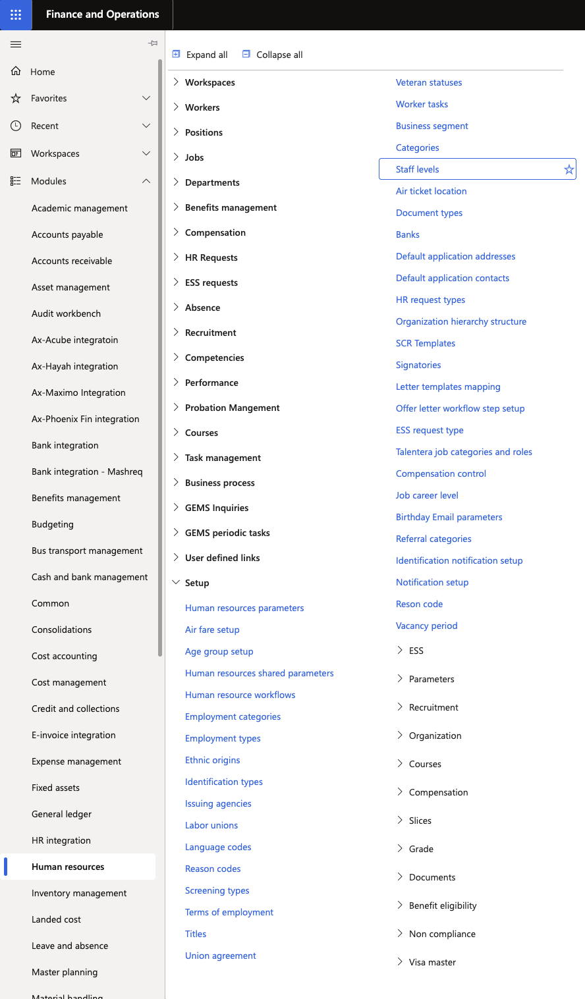
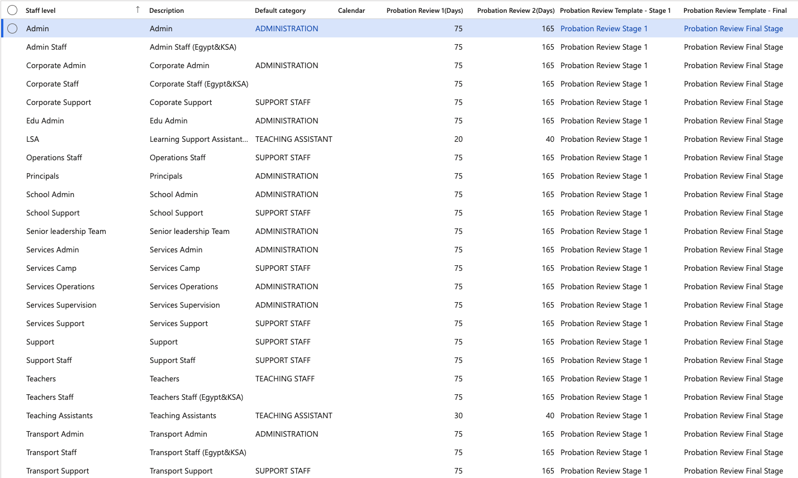

# Configure probation settings

Probation review settings are configured by staff level and category, controlling when Stage 1 and Stage 2 reviews are triggered for different employee types.

1. Open the probation configuration form

   In D365, navigate to the **Staff Levels** for probation configuration (accessible from the Human Resources module setup area).

   

2. Select a staff level and category combination

   Each row in the form represents a unique combination of **Staff Level** and **Default category** (for example, Teacher + Grade 1). Probation parameters differ per combination.

3. Set the review days

   For the selected combination, configure:
   - **Probation Review Days — Stage 1**: the number of days from the employee's start date when the Stage 1 review should be generated
   - **Probation Review Days — Stage 2**: the number of days from the employee's start date when the Stage 2 review should be generated

   

4. Select the review template

   In the **Template** field, select the review template to apply to this combination. The template defines which competencies are included and what rating model (e.g., Meets Expectations, Concerns, Needs Improvement) is used.

5. Save

   Click **Save** to apply the configuration.
