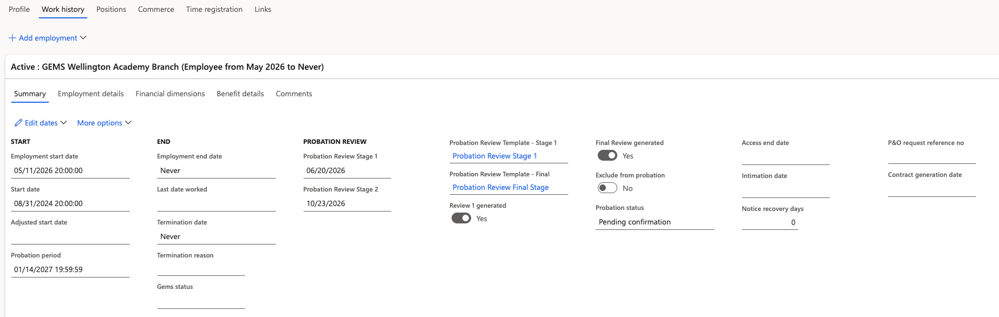

# Probation fields on an employee record

Probation fields are automatically populated on an employee's record when they are created in the system. HR can view and update these fields at any point during the process.

1. Open the employee record

   In D365, navigate to the relevant employee record within the Human Resources module.

2. Locate the probation fields

   The following probation fields appear on the employee record:

   | Field | Description |
   |---|---|
   | **Probation Review Stage 1 Date** | Auto-calculated from start date and Stage 1 review days |
   | **Probation Review Stage 2 Date** | Auto-calculated from start date and Stage 2 review days |
   | **Probation End Date** | Defaulted from probation parameters |
   | **Template** | The review template linked to this employee's staff level and category |
   | **Review 1 Generated** | Set to Yes by the batch when the Stage 1 review is created |
   | **Final Review Generated** | Set to Yes by the batch when the Stage 2 review is created |
   | **Probation Status** | Updated manually to **Confirmed** by HR after successful completion |
   | **Exclude from Probation** | Set to Yes to bypass the probation process for this individual |

   

3. Exclude an employee from probation

   If an employee should not go through the standard probation process, set **Exclude from Probation** to **Yes**. The batch process will skip this employee when generating reviews.

4. Confirm successful completion

   After Stage 2 completes with a "Meets Expectations" outcome, HR receives a notification. Update **Probation Status** to **Confirmed** on the employee record to finalise the process.
