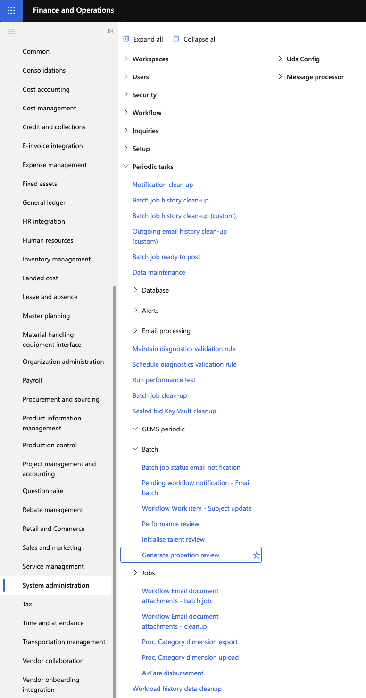
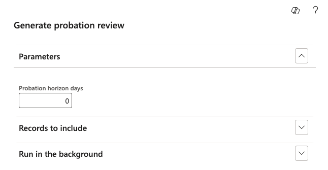

# Generate probation reviews

The Generate Probation Reviews batch process scans employee records for upcoming probation dates and creates the review records, routing them into the approval workflow for the assigned manager.

1. Navigate to the batch process

   In D365, go to **System Administration ▸ Batch Processes** and select **Generate Probation Reviews**.

   

2. Set the horizon

   Enter a value in the **Probation Horizon Days** parameter. The batch generates reviews for any employee whose Stage 1 or Stage 2 probation date falls within this many days from today.

   For example: setting the horizon to 10 days will capture any review date falling within the next 10 days. If a probation date has already passed, no review is generated for it.

   

3. Run the batch

   Click **Run** to execute the batch manually. Alternatively, schedule the batch to run nightly so no manual action is required on an ongoing basis.

4. Confirm the outcome

   After the batch runs:
   - The **Review 1 Generated** or **Final Review Generated** flag on the employee record is set to **Yes**.
   - A probation review record is created and submitted into the workflow.
   - The review appears in the manager's ESS queue under **Team Probation Review Requests**.
