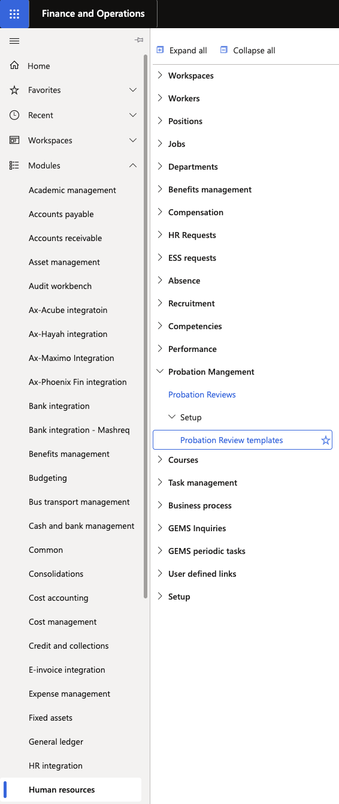
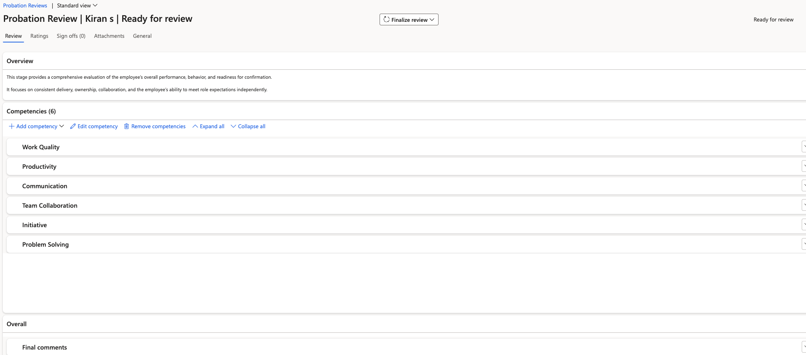

# Monitor probation reviews

HR can view all probation reviews — in progress or completed — from a central form in D365, including workflow status, manager ratings, and employee feedback.

1. Open the HR Probation Reviews form

   In D365, navigate to the **HR Probation Reviews** form within the Human Resources module.

   

2. Find the review

   Use the filter options to locate reviews for a specific employee, or view all active reviews across the organisation.

3. Review the record

   For each review you can see:
   - Employee name and review type (Stage 1 or Stage 2)
   - Manager's competency ratings and comments
   - Employee feedback comments
   - Current workflow status: Processing, Assigned, or Completed
   - For Stage 2 reviews: the **Review Outcome** (Meets Expectations / Performance Concerns)

   Stage 2 records show Stage 1 comments alongside Stage 2 comments for comparison.

   

4. View workflow history

   Click **View History** to trace the full workflow routing — who took each action, which workflow conditions evaluated to true or false, and when each step completed.

5. Confirm successful completion

   When a Stage 2 review completes with "Meets Expectations", HR is notified. Update the employee's **Probation Status** to **Confirmed** on their employee record to finalise the process. Where the outcome is "Performance Concerns", the workflow routes directly to HR only — the employee is not notified of the outcome, and HR takes the appropriate next steps.
