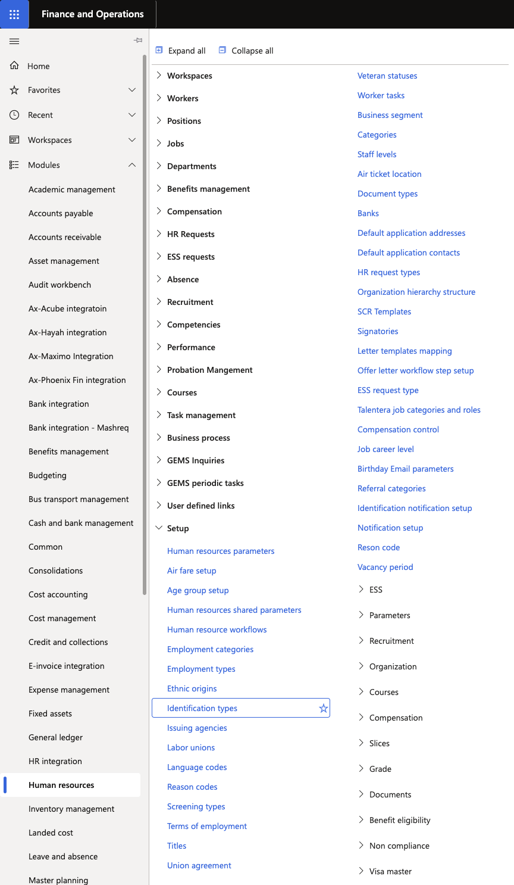
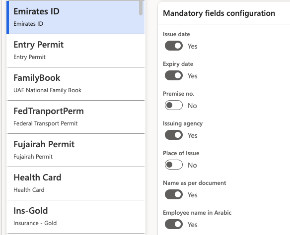

# Configure mandatory attachments and fields for identification

Each identification document type can have its own set of required fields and attachment rules. When an attachment is made mandatory, the Submit button in ESS is disabled until the employee uploads a file — preventing incomplete submissions.

1. Navigate to Identification Types setup

   In D365, go to the **Identification Types** setup form within the Human Resources configuration area.

   

2. Select a document type

   Choose the identification type to configure — for example, Passport, Emirates ID, Labour Card, or Medical Insurance.

3. Configure mandatory fields

   For each document type, specify which fields must be completed before submission. Different document types display different field sets — for example:
   - **Passport**: issue date, end date, place of issue
   - **Khamra**: agency field instead of country
   - **Medical Insurance**: no issuing agency required

   

4. Set the attachment requirement

   Toggle the **Attachment Required** flag on or off for this document type. When enabled, employees cannot submit the identification record without uploading a supporting file.

5. Scope by company and worker country/region

   Rules can be scoped per **legal entity (company)** and per **worker country/region**, allowing different requirements for employees across different schools or locations.

6. Save

   Click **Save** to apply the configuration. The rules take effect immediately for all new identification submissions in ESS.
