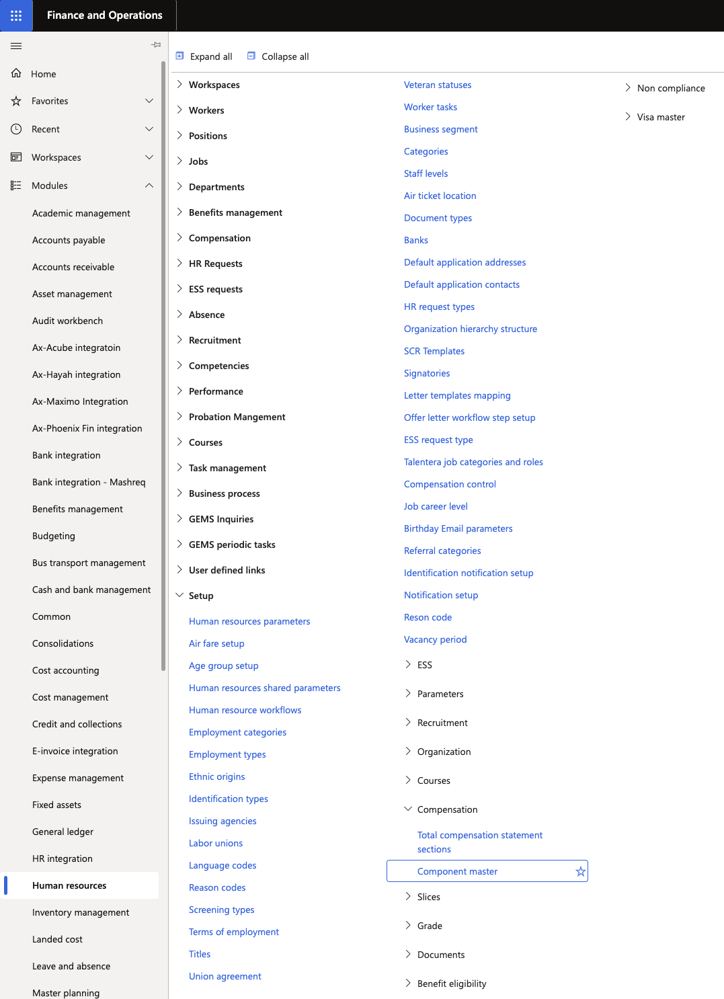
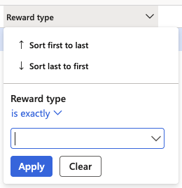
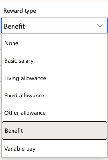

# Configure reward types on the component master

The **Reward Type** field on the component master classifies compensation and benefit components so they appear in the correct category on the employee rewards statement in ESS. Components without a reward type are excluded from the statement. This is a one-time configuration step for each applicable component.

1. Open the Component Master

   In D365, navigate to the **Component Master** form within the **Human Resources** or **Compensation** module.

   

2. Filter for relevant components

   To identify which components have already been configured, filter the **Reward Type** column where the value is not empty. This shows all components currently marked for inclusion in the rewards statement.

   To find components that still need to be configured, clear the filter and review all components.

   

3. Open a component

   Select the component you want to configure and click **Edit**.

4. Set the Reward Type

   In the **Reward Type** field, select the category that best describes this component. Available options include:

   - **Fixed Allowance** — recurring fixed allowance components
   - **Living** — living or accommodation-related allowances
   - **Other** — any other components to be included in the statement

   Components with a reward type set will appear in the corresponding category on the employee's rewards statement in ESS.

   

5. Save

   Click **Save** to apply the configuration.

   Repeat for each component that should appear in the rewards statement.
