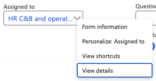
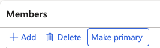

# Configure an Offboarding Checklist

Prepare the offboarding checklist for staff members who are leaving the company. Assign the primary user who will follow up on the offboarding process and identify who the task can be delegated to.

1. Navigate to the Offboarding checklist

   In D365, navigate to **Modules ▸ Human Resources ▸ Task Management ▸ Offboarding checklists**.

2. Select or create a checklist

   On the left, there is a list of checklists. Select the appropriate checklist. Or, if it's missing, create a new checklist. Once created, the checklist will be saved in the system and can be reused.

3. Assign users or user groups

   Click **Edit** in the navigation bar above the checklist items. From the **Assigned to** dropdown, select the group that will monitor the offboarding process. You can check the group details by right-clicking and selecting **View details**. Here, you can add names or selected roles to the list by using the filter function. Then click **Add and close**.

    

5. Assign the primary task owner

   Select the user from the list, then click the **Make Primary** button in the task bar above.

   

7. Save the changes

   Click **Save** to apply the changes.
