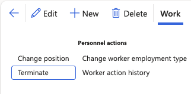

# Assign the Offboarding Checklist to Offboarding Employees

Send out the offboarding checklist to employees who are leaving the company.

> **Note**: Before starting this task, ensure that the offboarding checklist is ready and that the primary task owner has been assigned.

1. Navigate to the Employee section

   In D365, navigate to **Modules ▸ Human Resources ▸ Workers ▸ Employees**

2. Identify and select the offboarding employees

   Select the relevant employee, then click **Work** from the Action Pane. Under Personnel Actions, click **Terminate**.

   

4. Update the Termination reason, end date and status

   Select the correct status from the **Gemsstatus** dropdown. Update the **Termination reason**. Fill in the **Termination date** and the **Last day worked**. Complete the **Personnel action type** from the dropdown. Click **Continue**.

5. Assign a checklist for the employee

   Select **Actions** from the Action pane. Under Action, click **Checklists**. Click **Apply checklist.** In the pop-up, update the **Process type** to Offboarding. Select the **Target date** from the dropdown. The target date should match the selected end date from the previous step. Select the checklist and press the right-facing arrow. Click **OK**.
