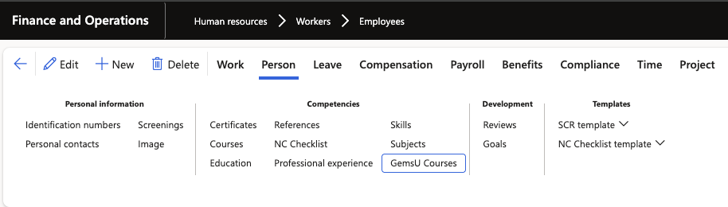
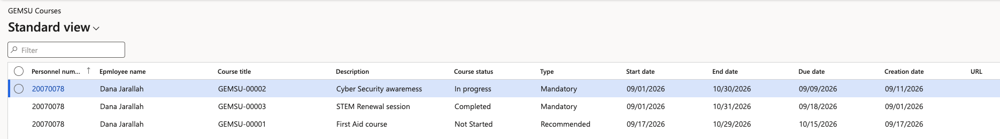

# View GEMSU courses for an employee

The GEMSU integration writes GEMSU course data into D365, giving HR a view of what learning each employee has been assigned and where they have got to. The integration populates records— they are not maintained manually on the employee record.

1. Open the employee record

   In D365, go to **Human Resources ▸ Workers ▸ Employees** and open the employee record for the learning you want to review.

2. Open the GEMSU course tracker

   On the employee record, select **Person** from the **Action Pane**. Under **Competencies**, open the **GEMSU Courses** tracker. It lists every course held against that employee.

   

3. Review the course details

   Each line shows:

   | Field | What it tells you |
   |---|---|
   | **Name** | The employee's name |
   | **Employee ID** | The employee's personnel number |
   | **Course status** | Where the employee has got to — for example, not started, in progress, or completed |
   | **Course type** | Whether the course is mandatory or recommended |
   | **Start date** | The date the course is due to start |
   | **Date registered** | The date the employee was registered on the course in GEMSU |

   This is the same data the employee sees under **GEMSU courses** in ESS.

4. Review courses across all employees

   To review learning across the workforce rather than one person at a time, open the all-employee GEMSU course form. **Human Resources ▸ Courses ▸ GemsU Courses**. It shows the same course lines for every employee, so you can filter by course status or course type to find, for example, everyone with an outstanding mandatory course. Similarly, check the GEMSU integration log (**HR integration ▸ Inbound ▸ GemsU courses integration Log**).

   

   If an employee's courses are missing or the status looks out of date, check the GEMSU integration log before contacting the GEMSU team.
