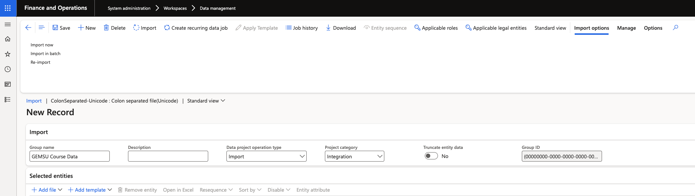

# Import GEMSU course data manually

Alongside the live integration, a data entity lets you load GEMSU course records from Excel. Use it for cutover or to import historical course data that predates the integration. Day-to-day course data arrives through the integration and does not need to be imported.

1. Prepare the source file

   Build your Excel file to match the fields on the GEMSU course entity — employee ID, course, course status, course type, start date, and date registered. Employee IDs must match existing personnel numbers in D365, or the rows will fail.

2. Open Data management

   In D365, go to **System administration ▸ Workspaces ▸ Data management** and create a new import project.

   

3. Select the GEMSU course entity

   Add the GEMSU course data entity to the project, upload your file, and map the source columns to the entity fields.

4. Run the import

   Run the import and review the results. Failed rows are reported against the project with the reason, so you can correct the file and re-run the failures.

5. Confirm the records landed

   Open the GEMSU integration log to confirm the imported records are present, then spot-check an employee record to confirm the courses show on their GEMSU course tracker.

   Imported courses appear in ESS for the employee in the same way as integrated ones, so check the data before running a large load.
