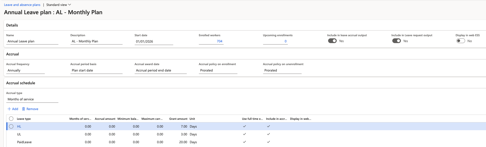
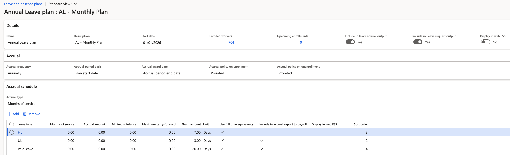
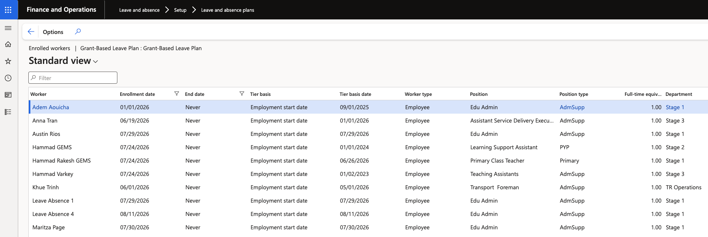

# Set up leave plans and leave types

Leave plans are the container for your leave types. There is no limit on how many plans you create and no fixed rule on how types are grouped — the structure is yours to decide, and it drives what employees can request in ESS.

1. Open the leave plan

   In D365, go to **Leave and absence ▸ Leave plans** and open an existing plan or create a new one.

   

2. Group your leave types into the plan

   At the bottom of the plan, add the leave types that belong to it. Types can be grouped however suits your policy — a plan can hold a single type or many.

3. Set the plan's ESS visibility

   At the header level, set whether the whole plan is visible in ESS. Plans set to **No** are hidden from employees entirely; only plans set to **Yes** appear in the ESS leave plan list.

4. Restrict individual leave types in ESS

   Visibility can also be controlled per leave type. A plan can be visible while specific types within it are hidden — so you can publish a plan and still keep one of its types back from employees. Either control works on its own; use whichever fits the policy.

5. Set the sort order

   The **sort order** on each leave type controls the order employees see in the ESS dropdown. Set it so the most commonly requested types come first.

6. Configure the accrual

   Against each leave type, set:

   | Field | What it controls |
   |---|---|
   | **Accrual type** | How the accrual is calculated — **months of service** or **hours worked** |
   | **Months of service** | The service period after which an employee becomes eligible for this leave type |
   | **Accrual amount** | The amount accrued per period |
   | **Carry forward** | How much unused balance carries into the next period |
   | **Minimum balance** | The minimum balance to be maintained |
   | **Include in accrual export** | Whether this plan or type is included when accruals are exported to payroll |

   

7. Configure grant-based leave types

   For leave that is granted as a fixed entitlement rather than accrued — maternity leave, for example — set the **grant amount** in working days, and switch on **full entitlement at once**.

   With that flag on, ESS forces the employee to take the whole grant as a single block: they select a start date, the system calculates the end date from the grant, and they cannot shorten it.

8. Review enrolled workers

   Open **Enrolled workers** on the plan to see who is enrolled. Each line shows the worker, their enrolment date, the enrolment basis (start date), worker type (worker or contractor), position type and department.

   

   Workers are enrolled through the hire and promotion worker actions rather than added here by hand — see [Assign leave plans through the hire worker action](./06-assign-leave-plans-on-hire.md).
