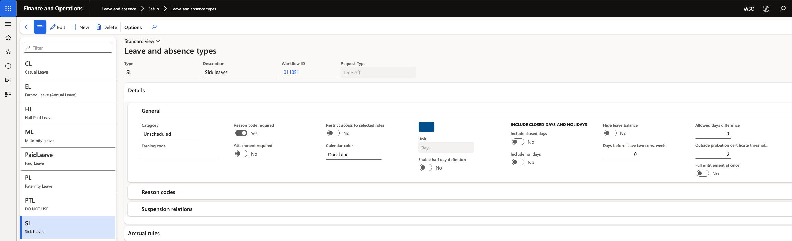

# Configure sick leave certificate rules

Certificate rules control when ESS insists on a supporting document before it will accept a leave request. The rule is set per leave type and can differ by school, and it applies differently depending on whether the employee has passed probation.

1. Open the leave type

   In D365, go to **Leave and absence ▸ Leave types** and open the type you are configuring — typically sick leave.

2. Set the certificate threshold

   Complete the **outside probation certificate threshold** in days. This is the number of days an absence can run before a medical certificate becomes mandatory for a confirmed employee — three days, for example.

   

   The value is set per legal entity, so each school can apply its own policy.

3. Understand how probation status changes the rule

   The employee's probation status on their work history determines which rule applies:

   | Probation status | Behaviour in ESS |
   |---|---|
   | **Pending confirmation** | A certificate is required for any request of this type, from the first day. Submitting without one returns *Please record at least one document* |
   | **Confirmed** | A certificate is only required once the absence exceeds the threshold. Shorter requests submit without one |

4. Save

   Click **Save**. The rule applies to new submissions in ESS immediately.

   The same mechanism works for any leave type, not only sick leave. Set a threshold in days against the type and ESS starts enforcing an attachment once a request goes beyond that number.
