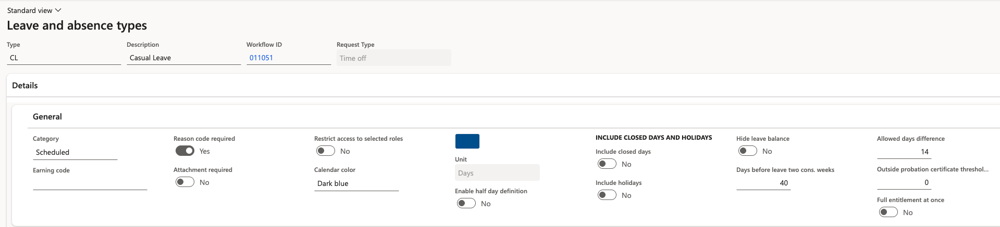

# Configure advance notice rules for long leave

Long absences usually need warning. An advance notice rule makes ESS refuse a request when the period is long enough to matter but the employee hasn't given enough notice.

1. Open the leave type

   In D365, go to **Leave and absence ▸ Leave types** and open the type you are configuring — for example, casual leave.

2. Set the trigger and the notice period

   Complete the two values that make up the rule:

   - The number of **consecutive days** at which the rule starts applying — 14 days, for example
   - The number of **days of advance notice** required for a request of that length — 40 days, for example

   

   Together these read as: a request of 14 or more consecutive days of this type must be submitted at least 40 days before it starts.

3. Save

   Click **Save**. The validation applies to new ESS submissions immediately.

4. Check the employee experience

   An employee whose request meets the day count but falls inside the notice period sees the submission rejected with a message naming both values — *Leave requests of 14 days or more for this type must be submitted at least 40 days in advance* — and the request is not created.

   The rule can be applied to any leave type. Leave the values blank on types where no notice period applies.
