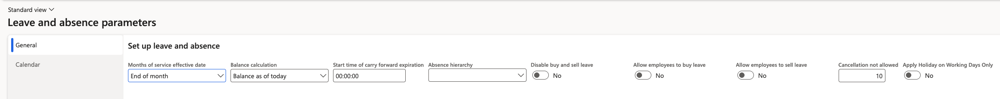

# Configure the leave cancellation window

Without a limit, an employee could cancel leave from a previous period and reopen a closed balance. The cancellation window sets how far back a request can be withdrawn — anything older is locked.

1. Open the leave and absence parameters

   In D365, go to the leave and absence parameters and find the cancellation setting.

   

2. Set the number of days

   Enter the number of days of leave history that remains cancellable — 10 days, for example. Requests older than this cannot be cancelled from ESS.

3. Understand how the window is measured

   The calculation runs from the **start date of the leave**, not from the date the request was submitted. A request submitted well in advance for leave that started yesterday is still inside the window; a request for leave that started two months ago is not, however recently it was raised.

4. Set the value per school where policies differ

   The parameter can be set per legal entity, so schools with different policies can hold different values.

5. Check the employee experience

   An employee attempting to cancel leave outside the window sees a message naming the age of the request — *Cancellation is not permitted because this request is 16 days old* — and the leave is left untouched. Cancellations inside the window are created and routed for approval as normal.

   Employees will bring genuinely old cancellations to HR instead, so keep the value in line with what your team is prepared to handle manually.
