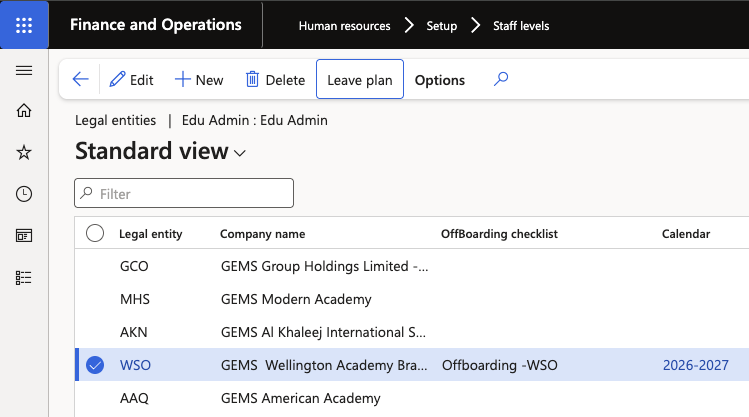
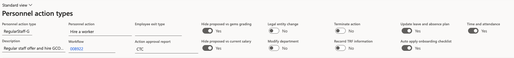

# Assign leave plans through the hire worker action

Employees are not enrolled in leave plans by hand. Enrolment is driven by the position they are hired into: the staff level attached to that position carries the leave plans, and the worker action applies them.

1. Set the calendar and leave plans on the staff level

   Open the **Staff levels** form (**Human resources ▸ Setup ▸ Staff levels**) and select the record you are configuring. Against each legal entity, select the **Calendar** and the **Leave plans=** that employees at that staff level should be enrolled in. You can assign more than one plan.

   

2. Enable the flag on the personnel action type

   Open the **personnel action type** used for hiring and set **Update leave and absence plan** to **Yes**.

   Only worker actions using an action type with this flag switched on will enrol employees or update their existing enrolments. The same flag drives transfers and promotions.

   

3. Complete the worker action

   Create the hire worker action for the new employee and complete the position assignment. The position determines the staff level and staff category, which is what links the employee to the leave plans configured in step 1.

4. Submit and approve the workflow

   Submit the action to workflow and approve it. The action stays **Pending** until the workflow completes — wait for the status to move to completed before checking the enrolment.

5. Confirm the enrolment

   Open the employee record and go to **Leave and absence**. The plans configured against their staff level are listed against them.

   

   If the plans are missing, check that the action type had the flag set before the action was submitted — enabling it afterwards does not retrospectively enrol the employee.
