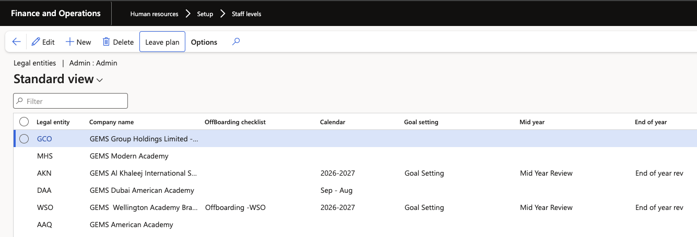

# Update leave plans through a promotion action

When an employee moves to a new position, the leave plans attached to their new staff level are applied. The mechanism is the same as the hire action — the flag on the personnel action type is what makes it happen.

1. Check the leave plans on both staff levels

   Before submitting, open the **staff level** form and note the leave plans held against the employee's current staff level and against the one they are moving to. This tells you what to expect after the action completes.

   For example, an employee moving from an education admin staff level to a school admin staff level picks up whichever plans are configured against the new level for that legal entity.

   

2. Confirm the flag on the personnel action type

   Open the **personnel action type** used for the promotion and confirm **Update leave and absence plan** is set to **Yes**. Without it, the position changes but the leave enrolment does not.

3. Create the promotion action

   Create the promotion worker action for the employee and complete the position assignment with the new position. The position carries the staff category and staff level that drive the leave plan assignment.

4. Submit and approve the workflow

   Submit the action to workflow and approve it. Wait for the header status to move from **Pending** to completed.

5. Confirm the new position and enrolment

   Open the employee record and check the position assignment — you should see both position records where the previous position is still active. Then open **Leave and absence** to confirm the plans for the new staff level have been added.

   

6. Retire the previous position where your process requires it

   A promotion adds the new plan alongside the existing enrolment. Where your process is to retire the previous position, retiring it also retires the plans attached to it — leaving the employee on the new staff level's plans only.

   Confirm which approach your schools follow before running promotions in bulk, so enrolments do not accumulate across old positions.
