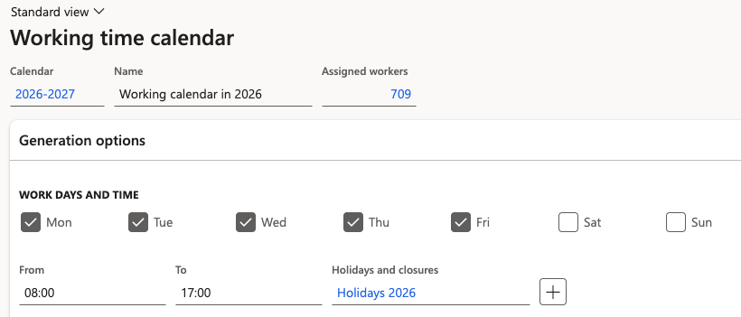
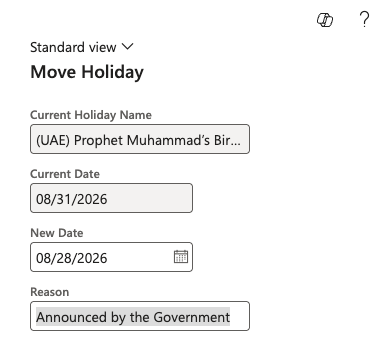
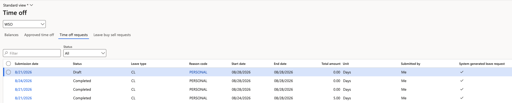

# Move a public holiday and manage the impact on leave

Public holidays are frequently announced or moved after employees have already booked leave around them. Moving the date in the calendar is all HR needs to do — the system finds the affected requests and corrects them, in both directions.

1. Open the calendar

   In D365, go to **Leave and absence ▸ Setup ▸ Calendars** and open the calendar for the legal entity.

2. Open holidays and closures

   Open the **holidays and closures** for that calendar. This is where announced holidays are recorded.

   

3. Move the holiday and record a reason

   Select the holiday and move it to its new date. Enter a reason for the change — for example, *Holiday moved due to announcement* — then click **OK**.

   

4. Let the system adjust the affected requests

   On confirmation, the system checks every leave request for that legal entity against the change and adjusts them. A message confirms the holiday was moved. The behaviour depends on the direction of the change and the status of the request:

   | Change | Approved leave | Leave in review |
   |---|---|---|
   | A day inside the leave becomes a **holiday** | The day is cancelled and returned to the employee's balance | The day is removed from the request and the day count reduces — a five-day request becomes four |
   | A day inside the leave becomes a **working day** | Leave is submitted for that day automatically, keeping the leave continuous | Leave is submitted for that day automatically and the request is extended |

5. Confirm the system-generated requests completed

   Each adjustment is raised as its own request with the **system generated leave** flag set to **Yes**. Because the workflow condition auto-approves that flag, they complete without going to an approver. Give the process a few minutes, then refresh the time off requests to confirm the status has moved to completed.

   

   If these requests stay in review rather than completing, the auto-approval condition is missing from the workflow — see [Configure the leave approval workflow](./02-configure-leave-approval-workflow.md).

6. Verify the balances

   Check the employee's balance as of a date after the change to confirm it reflects the adjustment. Balances are recalculated once the system-generated request completes, not at the moment the holiday is moved.
