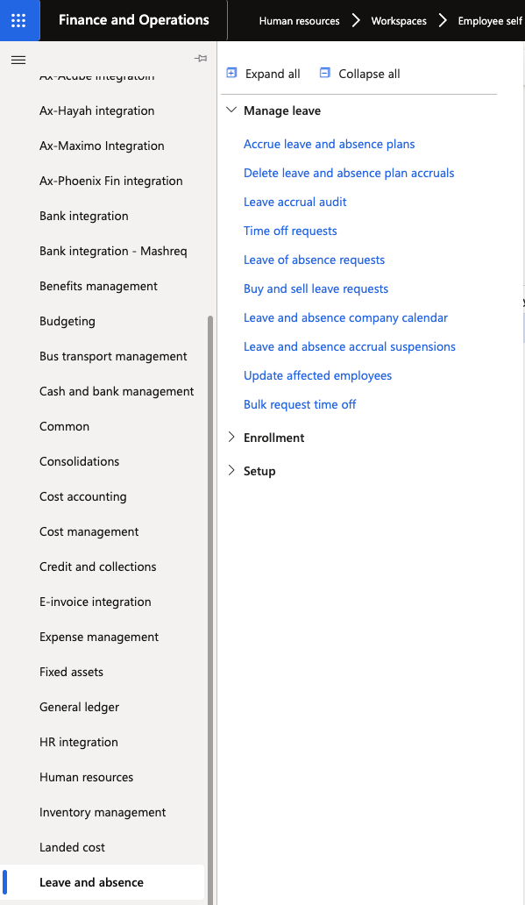
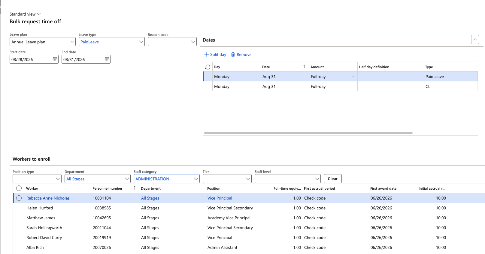
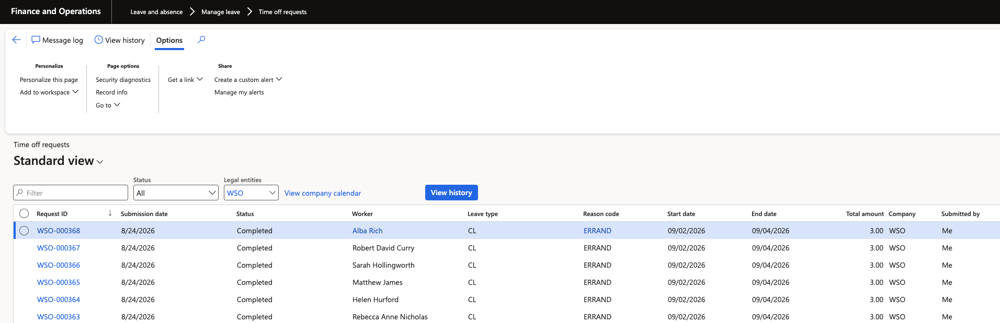

# Submit leave requests in bulk

Where a whole group needs the same leave booked — a scheduled closure for teaching staff, for example — HR can submit the requests in one pass rather than asking each employee to raise their own.

1. Open the bulk request form

   In D365, go to **Bulk request time off**.

   

2. Select the leave details

   Choose the **leave plan** and **leave type** to be booked, and select the **reason code** where the type requires one.

3. Set the dates

   Enter the **start date** and **end date** of the period to be booked. The same dates apply to everyone included in the run.

4. Filter the worker list

   Narrow the list to the group you are booking for. Filters are available for **position type**, **department** and **staff category** — for example, filtering department to all stages, or staff category to admin support.

   

   Use **Clear** to reset the filters and start again.

5. Select the workers

   Tick the individual workers to include, or use **select all** to take everyone left after filtering. Check the selection before continuing — the requests are created immediately and approve without review.

6. Assign the leave

   Click **Assign leave**. A leave request is created for every selected worker.

7. Confirm the requests completed

   The requests are created as **system generated**, so the workflow condition approves them automatically rather than routing them to managers. Give the process a moment, then check the results either on an individual employee's time off requests or on the main time off requests list, where all of them are visible together.

   

   If the requests stay in review, the auto-approval condition is missing from the workflow — see [Configure the leave approval workflow](./02-configure-leave-approval-workflow.md).
