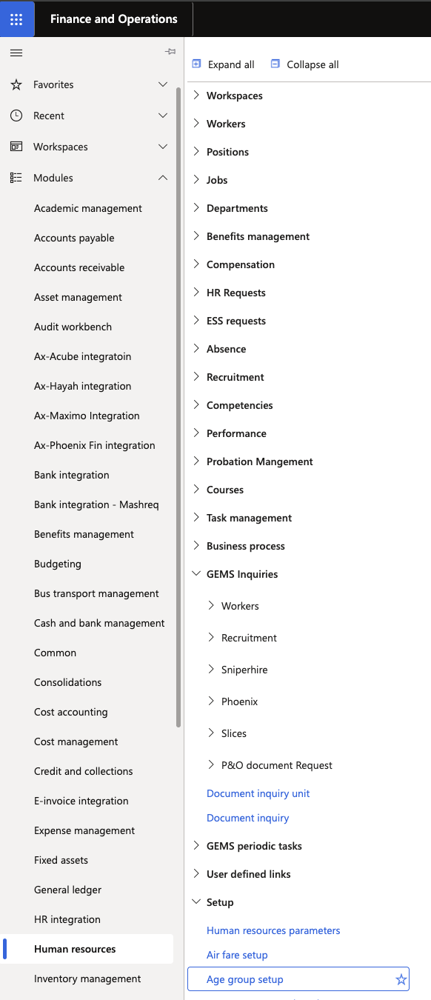
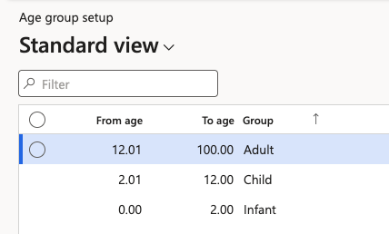

# Set up airfare age groups

Age groups decide which fare a dependent attracts. Each band is a range of ages with a fare category attached, and the system matches a dependent's **birth date** against those bands to work out whether they are charged as an infant, a child or an adult. Set these up before the airfare rates — the rate table carries an amount per category, so the categories have to exist first.

1. Open the age group setup

   In D365, go to **Human Resources ▸ Setup ▸ Age group setup**.

   

2. Create a band for each fare category

   Add a line for each category and set the age range it covers:

   | Field | What it controls |
   |---|---|
   | **From age** | The lower bound of the band, in years |
   | **To age** | The upper bound of the band, in years |
   | **Age group** | The fare category the band maps to — infant, child, or adult |

   A typical configuration runs **0 to 2** for infant and **2 to 12** for child, with anyone above the top band treated as an adult. Set the ranges to match your travel policy.

   

3. Save

   Click **Save**.

   The bands apply across all legal entities — they are not set per company. Only the fare amounts in [Set up airfare rates](./02-set-up-airfare-rates.md) vary by legal entity.

4. Check the bands before running a new airfare year

   A dependent's category is not fixed for the whole airfare period. The calculation checks the birth date against the bands across the period, so a dependent who crosses a boundary part-way through is paid partly at one rate and partly at the next — see [Review calculated airfare](./05-review-calculated-airfare.md).

   Because of that, changing a band after calculations have run changes the result for anyone near a boundary. Adjust the bands before running the calculation for a new airfare year rather than part-way through one.
