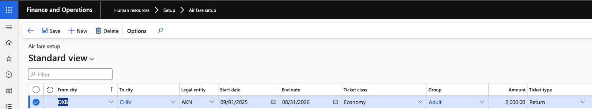
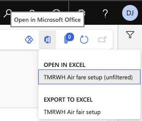
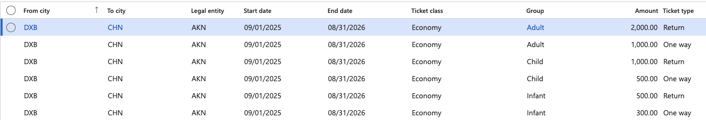

# Set up airfare rates

The airfare setup table holds the fare the calculation draws on: an amount per passenger category, for a route, for a legal entity, over a period. Travel release the year's fares, and those fares are loaded here — usually as a single bulk upload rather than record by record.

1. Open the airfare setup

   In D365, go to **Human Resources ▸ Setup ▸ Airfare setup**.

   

2. Create the fare record

   Click **New** and complete the header:

   | Field | What it controls |
   |---|---|
   | **Legal entity** | The company the fare applies to. Each school holds its own rates |
   | **From city** | The origin of the ticket |
   | **To city** | The destination |
   | **Ticket class** | Economy, premium economy, business class or first class |
   | **Ticket type** | Return or one way |
   | **From date** / **To date** | The airfare period the rate is valid for — this is the period the calculation pro-rates against |

   **From city** and **To city** hold the same values as the employee's air ticket location fields. They have to match for the calculation to find a fare — see [Set employee and dependent airfare details](./03-set-employee-and-dependent-airfare-details.md).

   

3. Enter the amount per age group

   Against the record, set the fare for each age group configured in [Set up airfare age groups](./01-set-up-age-groups.md) — adult, child and infant. These are the full-period amounts; the calculation reduces them where someone is entitled to less than the full period.

   

4. Add a record per ticket class and ticket type

   Create a separate record for each combination you need. A route travelled in economy and in business is two records; the same route as a return and as a one way is two more. The calculation picks the record matching the class and type the employee or dependent is entitled to.

5. Save

   Click **Save**.

   A duplicate check applies across the whole key — from city, to city, legal entity, start date, end date, ticket class, age group and ticket type. Only one record may exist for a given combination, so you are blocked on save rather than ending up with two competing fares.

6. Load the year's rates in bulk instead

   Rates do not have to be created by hand. A data entity is provided for the airfare setup table, so once Travel release the fares for the year they can be loaded across every legal entity in one upload.

   On the Airfare setup form, click **Open in Microsoft Office** in the Action Pane, select the airfare setup data entity, populate the file with the year's rates, and publish it back.

   

   The duplicate check applies to uploaded rows as well as manually created ones, so a re-upload over an existing period is rejected rather than silently overwriting. Remove the superseded records first if you are reloading a period.
