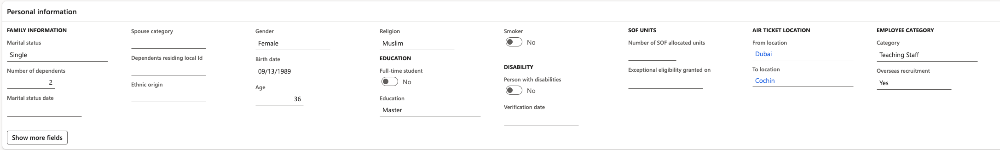
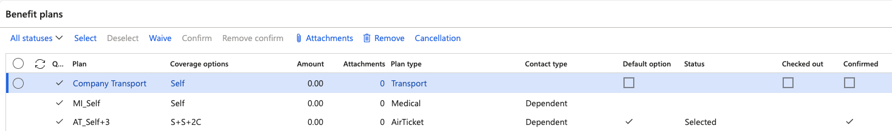

# Set employee and dependent airfare details

The calculation reads three things off the employee: where they travel, who travels with them, and what they are entitled to. All three live in records HR already maintains — this page ensures theyare correct before the calculation runs, because a missing route or a blank valid-from date produces a wrong or missing figure later.

1. Set the employee's air ticket location

   Open the employee record and go to **Personal information** on their profile. Set the air ticket location **From** and **To** fields.

   These values match **From city** and **To city** in the airfare setup. If the pair does not match a fare record for the employee's legal entity, no fare is found, and nothing is calculated.

   

2. Check the employment start date

   The employee's start date in **Employment history** determines whether they get the full fare or a reduced one. An employee whose employment covers the full airfare period is entitled to the full amount; those who join partway through are prorated from their start date.

   The same start date also serves as the reference point for dependents.

3. Review the dependents

   Select **Person** in the Action Pane. Under **Personal information**, open **Personal contacts** on the employee record. For each dependent, check:

   | Field | Why it matters |
   |---|---|
   | **Active dependent** | Must be set to **Yes**. Dependents without the flag are skipped entirely — no line is written for them |
   | **Birth date** | Matched against the age groups to decide whether the dependent attracts the infant, child or adult fare. Age is assessed against the end date of the airfare period |
   | **Valid from** | The date the dependent becomes valid against the employee. The calculation runs from this date, so a late-entered dependent is pro-rated from it |
   | **Valid to** | Must extend beyond the end date of the airfare period for the dependent to be covered to the end of it |
   | **Ticket class** | The class the dependent travels in, on the last tab of the dependent details |

4. Correct the valid from date when it is late

   The **valid from** date is set when the dependent record is created, which is often later than the date the dependent actually joined the family — an employee may only add a newborn once the birth certificate is through. The calculation takes the date at face value, so a dependent added a month late is paid a month short.

   Where the entitlement should run from an earlier date, correct the **valid from** date before running the calculation. If the calculation has already run, correct it and rerun — see [Run the airfare calculation](./04-run-the-airfare-calculation.md).

5. Adjust the dependent's ticket class where it differs

   The **Ticket class** field on the dependent defaults from the employee's own entitlement and can be changed. Use it when the employee travels in a higher class than their family— for example, an employee eligible for business whose dependents travel economy.

   **Ticket type** — return or one-way — comes from the job attached to the employee's position and defaults down to the dependents the same way. Refresh it when the employee's position changes, or the dependents keep the type from the old job.

6. Confirm the benefit enrolment

   Select **Benefits** from the Action Pane. Under **Plans**, open **Worker benefit plans** for the employee. Eligibility is read from the row where the **Plan type** is **AirTicket** and the status is **Selected** and **Confirmed**—that row sets the number of tickets the employee is entitled to, the class, and whether the entitlement is return or one-way. An entitlement reading *self + 3, economy, return* covers the employee and three dependents on economy return tickets.

   The count is a cap. Where an employee has more active dependents than the entitlement covers, the surplus is not calculated — so check the number of active dependents against the entitlement before querying a missing line.

   If no row is selected and confirmed, the eligibility cannot be derived, and the calculation skips the employee.

   
