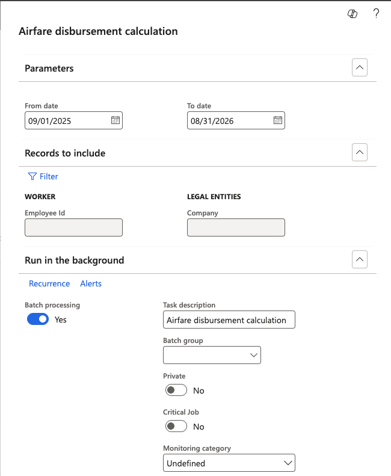

# Run the airfare calculation

The calculation is a batch process. It reads the employee's route, start date, benefit enrolment and dependents, finds the matching fare, and writes a calculated line for the employee and for each dependent. The same batch handles recalculation, so it is what you run both for the annual disbursement and for a one-off correction.

1. Confirm the setup is complete

   Before running, check that the age groups exist, that fare records cover the period for the legal entity and route, and that the employee details are right — see [Set employee and dependent airfare details](./03-set-employee-and-dependent-airfare-details.md).

2. Open the calculation

   In D365, open the airfare calculation batch under **Human Resources**.

   

3. Set the parameters

   | Parameter | What to set |
   |---|---|
   | **Legal entity** | The company being calculated |
   | **Employee** | Leave blank to run across the whole workforce, or name a single employee to calculate just that record |
   | **From date** / **To date** | The airfare period. These must match the dates on the fare records in the airfare setup |

   The from and to dates are what the pro-rata is measured against, so a mismatch between these and the fare record period produces amounts that do not reconcile.

4. Run the batch

   Click **OK** to submit. The job runs in the background — the batch is added to the queue and the calculated lines appear once it completes.

   

5. Check the results

   Open the calculated airfare form and confirm lines have been written for the employee and each of their dependents. The employee and their dependents are all calculated in the same run — see [Review calculated airfare](./05-review-calculated-airfare.md).

6. Recalculate after a correction

   There is no separate recalculation process. After correcting a birth date, a valid from date, a route or a fare, filter the calculated airfare form to the employee, delete their existing calculated lines, and run the batch again for that employee and the same period.

   Deleting first matters — leaving the old lines in place means you are reading a mix of old and new figures on the same form. For a correction affecting one person, run the batch with the employee named rather than across the whole workforce; it completes faster and leaves the rest of the workforce untouched.
