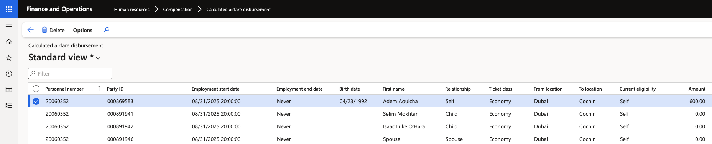

# Review calculated airfare

The calculated airfare form — the disbursement form — holds the output of the calculation: one line for the employee and one for each dependent, for the period the batch was run for. Work through it in this order to understand why an amount is the value it is.

1. Open the calculated airfare form

   Filter to the employee. There is one line for the employee and one for each dependent covered by their entitlement.

   

2. Understand how an amount is worked out

   Each line starts with the full fare set in the airfare setup for that route, ticket class, ticket type, and age group. Where the entitlement covers the whole airfare period, the line carries that full fare. Where it covers part of the period, the fare is reduced by days—the full fare divided by **365** to get a daily rate, multiplied by the days covered. The divisor is always 365, whatever the length of the period. Nothing else is applied: no rounding to months and no minimum, which is why amounts rarely come out as round numbers.

   An entitlement that covers the whole period takes the full fare directly rather than being built up from the daily rate, so a leap year does not overpay a full-period line. It can round part-period lines slightly high, though — in a 366-day period, the days covered are counted for real but still divided by 365, so a dependent covered for all but one day reaches the full fare.

   What counts as days covered differs between the employee and their dependents:

   | Record | Days are counted from |
   |---|---|
   | **Employee** | Their employment start date, or the start of the airfare period if they were already employed |
   | **Dependent** | Their **valid from** date on the personal contact record |

3. Read a full-period entitlement

   An employee whose employment covers the whole airfare period, with no end date, is entitled to the full amount. On a route with a return adult fare of 3,000, their line reads 3,000, and a spouse in the same class and type also reads 3,000. Dependents whose valid-from date sits before the start of the period take their full category fare — 1,500 for a child, 1,000 for an infant.

4. Read a part-period entitlement

   An employee joining part-way through the period is reduced from their start date, and dependents are reduced from their own valid-from date. The two are independent.

   A dependent valid from 6 October, against a period starting 1 September, is covered for 330 of the 365 days, so an infant fare of 1,000 calculates as 1,000 ÷ 365 × 330 = 904. The employee and every dependent are calculated in the same run, so a part-period employee with part-period dependents produces a reduced line for each of them at once.

5. Read a line where the age group changed

   A dependent's age group is assessed against the **end date** of the airfare period, so a dependent who crosses a boundary part-way through is already in the higher group by the time the period closes. Where that happens the line is split: the days before the birthday are paid at the lower fare, the days after at the higher one, each at that fare's daily rate. The result is a single amount combining both.

   This is worth watching at the start of an airfare year. A dependent whose birthday falls just inside the period attracts more than the infant fare alone; one whose birthday falls just outside it stays on the lower fare for the whole period.

6. Read a dependent added part-way through the year

   A dependent added during the year — most often a newborn — is covered from their **valid from** date to the end of the period. An infant added with a valid from date of 5 November, against a period ending 31 August, is covered for 300 of the 365 days in that period: 1,000 ÷ 365 × 300 = 821.

   The valid from date is the date the dependent record became valid, not the date of birth. Where an employee submitted the details late, correct the valid-from date first, then recalculate — see [Run the airfare calculation](./04-run-the-airfare-calculation.md).

7. Work back through the inputs when a figure looks wrong

   Check in this order:

   - **The fare** — the airfare setup record for the employee's legal entity, route, class and ticket type, and whether its from and to dates match the period the batch was run for.
   - **The dates** — the employee's employment start date, and the dependent's valid from date.
   - **The birth date** — this decides the age group, and a wrong one moves a dependent between fares.
   - **The enrolment** — the confirmed worker benefit enrolment sets how many tickets and which class.

   Correct the input, delete the employee's existing calculated lines, and run the batch again for that employee.
