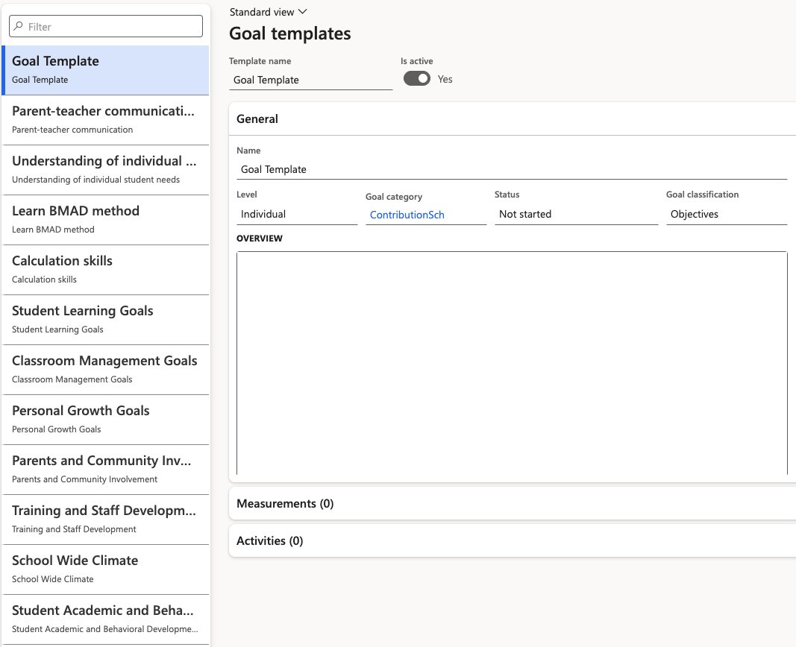
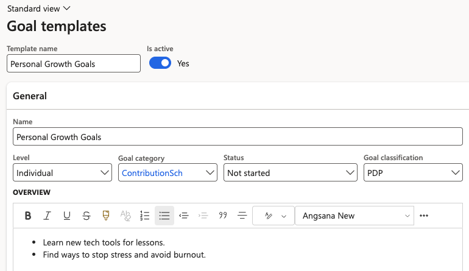

# Set up goal templates

Goal templates are the library of goals available to your organisation. Nothing in the performance cycle works until this library exists — review templates pull their goals from here, and those goals are then copied onto every review the batch job generates.

This setup is for HR, HR administrators and IT only. Employees never see these forms.

1. Open the goal templates form

   In D365, go to **Human Resources ▸ Performance ▸ Goal templates**.

   

2. Create a goal

   Add a record for each goal you want available. Complete:

   | Field | What it holds |
   |---|---|
   | **Name** | The goal as it will appear to employees and managers |
   | **Level** | The level the goal applies at |
   | **Goal category** | The grouping the goal belongs to |
   | **Status** | Whether the goal is currently available for use |
   | **Goal classification** | The type of goal — see the next step |

3. Set the goal classification

   **Goal classification** is what separates the different kinds of goal your reviews carry — objectives, competencies, PIP and PDP goals all sit here. The classifications available come from the goal types already defined in the existing system, so the list mirrors what your organisation uses today.

   

4. Add as many goals as you need

   There is no practical limit. Build out the full library before moving on — you can add more later, but doing it up front means your review templates are complete first time.

Once your library is in place, group the goals into the reviews that use them — see [Set up review templates](./02-set-up-review-templates.md).
