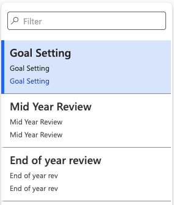
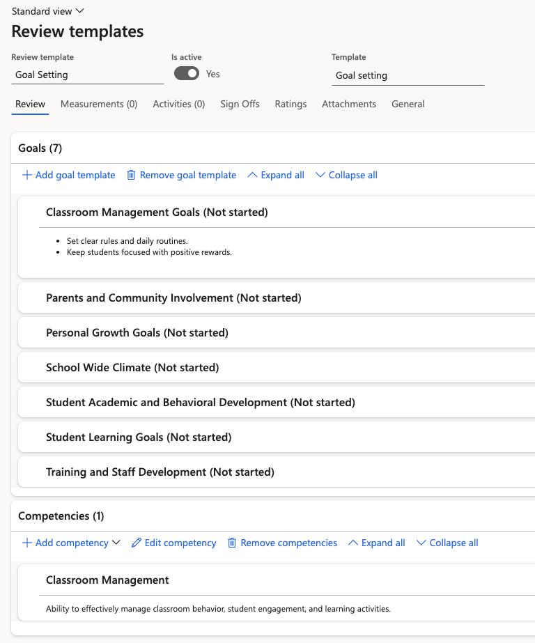
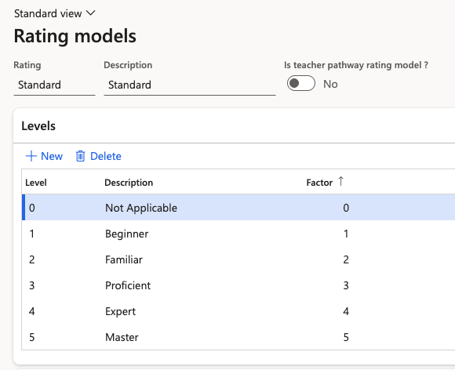

# Set up review templates

A review template defines one stage of the performance cycle — what goals it carries and how it is rated. You need one for each stage you run: goal setting, mid year review and end of year review.

1. Open the review templates form

   In D365, go to **Human Resources ▸ Performance ▸ Review templates**.

   

2. Create a template for each stage

   Create three templates — one for goal setting, one for the mid year review, and one for the end of year review. Name each one for the stage it covers; you select the template by name when you generate reviews, so the naming needs to be unambiguous.

3. Add the goal templates

   Open the template and use the add button to bring in goal templates from your goal library. You are shown the list of goals already set up — select the ones this review should carry and click **OK**.

   Add every classification the stage needs. A goal setting template, for example, typically carries both objectives and competencies.

   

   The goals you add here are copied onto each individual review when the batch job runs, so a template holding seven goals produces reviews with those seven goals already populated.

4. Set the rating model

   Go to the **General** tab and select the **Rating model** the stage uses. The standard model applies unless your organisation has defined its own.

5. Switch on the rating weight factor

   On the same tab, enable the rating weight factor. This is what allows the system to calculate an employee's **average score** and **total score** across the performance cycle — without it, the scores shown at the end of the year review are not produced.

   

Review templates are only half the setup — the system also needs to know which year and which period a review belongs to. See [Set up the performance year and calibration framework](./03-set-up-the-performance-year-and-calibration-framework.md).
