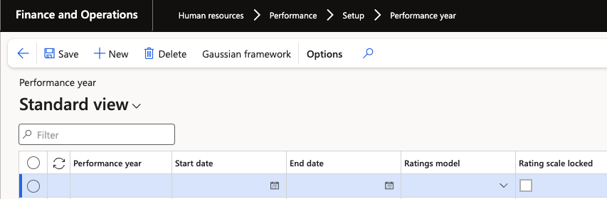
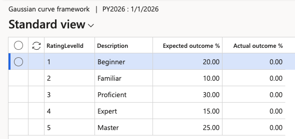

# Set up the performance year and calibration framework

The performance year ties the whole cycle together — every review period and every generated review belongs to one. It also includes the calibration framework, the expected distribution of ratings HR compares actual results against during calibration.

This is a once-a-year task. Set it up when the school year starts, and it needs no further attention until the next year.

1. Open the performance year form

   In D365, go to the **Performance year** setup under **Human Resources ▸ Performance ▸ Setup ▸ Performance year**.

   

2. Create the year

   Create a single record for the year and set:

   | Field | What it holds |
   |---|---|
   | **Start date** | The first day of the performance year |
   | **End date** | The last day of the performance year |
   | **Rating model** | The rating model used across the year — the standard model unless your organisation has its own |

   You can choose the start and end dates, so the performance year can follow the school year rather than the calendar year.

3. Open the Gaussian curve framework

   With the year selected, click **Gaussian framework** from the Action Pane.

4. Enter the expected distribution

   Enter the percentage of employees expected to fall into each rating band. This is the curve calibration works against — during calibration, HR sees expected against actual side by side, so a band set to 20% showing 30% of employees is immediately visible as a gap.

   

   Set up the framework before the end-of-year reviews are submitted. Calibration has nothing to compare against until these percentages are in place.

Next, divide the year into the stages you will run — see [Set up performance periods](./04-set-up-performance-periods.md).
