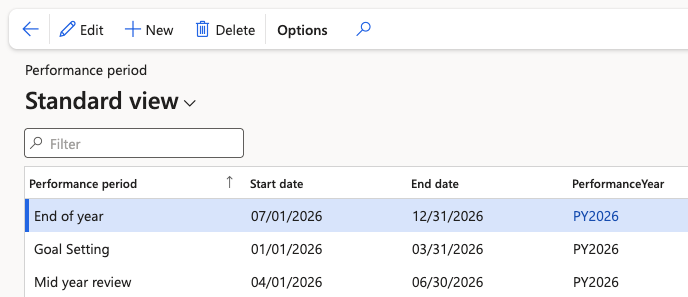

# Set up performance periods

Performance periods divide the performance year into the stages you actually run. You select a period when you generate reviews, and the period's dates control when those reviews can be created.

1. Open the performance period form

   In D365, go to the **Performance period** setup under **Human Resources ▸ Performance**.

   

2. Create a period for each stage

   Create three records — goal setting, mid year review, and end of year review — and set the **Start date** and **End date** of each. For example, a goal setting period might run 1 January to 31 March.

   The dates matter beyond record keeping: when you generate reviews, the creation date you enter must fall inside the period's date range. See [Generate performance reviews](./06-generate-performance-reviews.md).

3. Attach the performance year

   Set the **Performance year** on every period. This is the step most easily missed, and a period without its year attached does not function — link each one before you save.

   

Like the performance year itself, periods are set up once when the year starts and then left alone until the following year.
