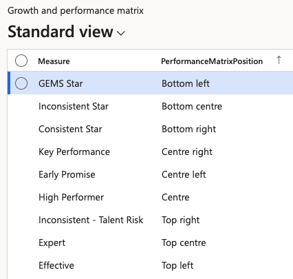

# Configure the growth and performance matrix

The growth and performance matrix is the grid employees are placed on during the year — GEMS Star, High Performer, Inconsistent - Talent Risk and the rest. Each measure occupies a box on the matrix, the employee gets rated into a particular box.

The layout is not fixed. Each measure's position on the grid is configurable, so you can match the matrix to the framework your organisation has agreed.

1. Open the matrix setup

   In D365, type **Growth and performance matrix** into the search box at the top of the screen and open the result. Or follow the pathway: **Human resources ▸ Competencies ▸ Setup ▸ Growth and performance matrix**.

   

2. Review the measures

   The matrix defines the **Measures** and identifies their **Performance Matrix Positions**. The positions of each measure can be edited 

3. Keep each value to one box

   Define each value only once across the matrix—the system enforces this, so you cannot place the same measure in two boxes. If you are moving measures around, clear a value from its old position before reusing it.

This form configures the matrix but is not where you use it. HR and managers place employees on the matrix and move them between boxes from the **manager view in ESS** — see *Use the growth and performance matrix* in the ESS guide. The placements made there are written back to the employee's talent review record in D365, covered in [View talent review records](./09-view-talent-review-records.md).
