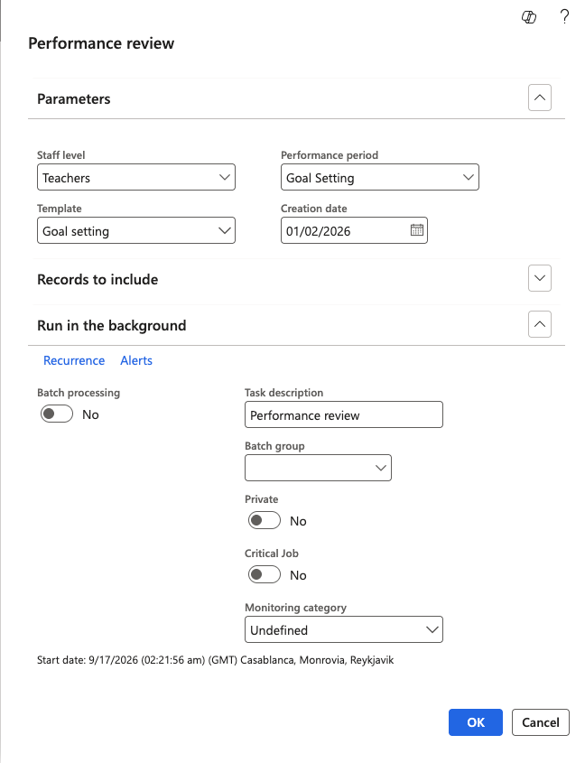

# Generate performance reviews

Reviews are not created by employees — HR or IT releases them across the organisation by running a batch job. You run it once per stage: once to release goal setting, again for the mid year review, and again for the end of year review.

1. Find the batch job

   In D365, go to **System administration ▸ Periodic tasks ▸ GEMS periodic batch jobs** and open the performance reviews job.

   All the custom batch jobs — probation, performance, talent review — are grouped here, so this is the one place to look rather than searching for each job by name.

   

2. Select the performance period

   Choose the period you are releasing — goal setting, mid year review, or end of year review — and enter its **Start date** and **End date**. For a goal setting run these would be the period dates you configured, for example 1 January to 31 March.

3. Set the creation date

   The **creation date** must fall inside the date range of the performance period you selected. A creation date outside the period will not produce reviews, so check this before running the job — it is the most common reason a run comes back empty.

   

4. Select the review template

   Choose the **review template** that matches the period. Releasing the goal setting period with the mid year template attached produces reviews carrying the wrong goals, and the mismatch is not obvious until employees open them.

5. Choose who the reviews are generated for

   To generate for a single employee, enter their **personnel number**. This is useful for testing or for catching up one person.

   Leave the personnel number blank to generate reviews for everyone in the legal entity. This is the normal run at the start of a stage.

6. Run the job

   Click **OK**. The job creates one review per employee in scope, with the goals from the review template already copied onto each one.

7. Check the results

   Go to **Human Resources ▸ Performance ▸ Reviews** and refresh. Your generated reviews appear in the list. Open one and check the goals have copied across — a template holding seven goals should produce a review with those seven goals populated.

   

Once generated, the reviews appear in ESS for employees to complete. You can follow their progress from the same Reviews list — see [Track performance reviews in D365](./07-track-performance-reviews.md).
