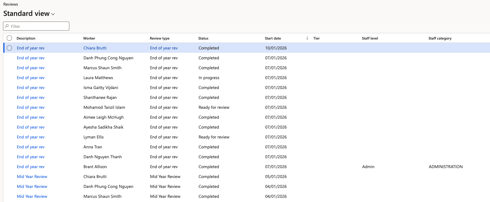
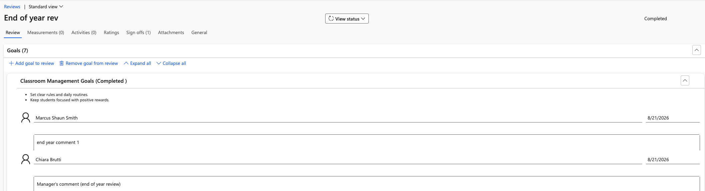
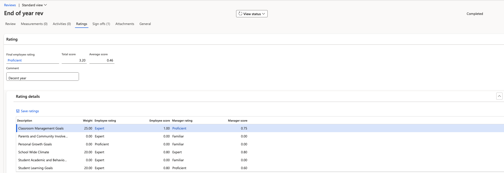

# Track performance reviews in D365

The Reviews list is where HR confirms the batch job worked and follows reviews as employees and managers complete them. Everything submitted from ESS is visible here, including comments and ratings from both sides.

1. Open the Reviews list

   In D365, go to **Human Resources ▸ Performance ▸ Reviews**. If you have just run the batch job, refresh the list to bring the new records in.

   

2. Check a review's status

   The status tells you where the review has reached:

   | Status | What it means |
   |---|---|
   | **Not started** | The review has been generated but the employee has not submitted it |
   | **Ready for review** | The employee has submitted; it is now with the manager |
   | **Completed** | The manager has submitted their feedback and the stage is closed |

   Status changes are driven by the standard workflow engine, so allow a moment after a submission before expecting the list to update.

3. Open a review to see the detail

   Open a record to see the goals it carries and the responses against each one. Both sides are visible — the employee's comments and the manager's comments sit together, so you can see the full exchange without switching screens.

   

   Manager comments are visible to HR here but are not all exposed to the employee in ESS.

4. Check the ratings

   Go to the **Ratings** tab to see every rating recorded against the review, along with its weight. Scroll down for the totals — the weightings should sum to 100.

   

   Two things are worth knowing when reading this tab:

   - **PIP and PDP goals carry no rating and no weight.** These are released ad hoc to support an employee's development, so they are deliberately excluded from the scoring.
   - **Total and average scores are calculated on submission.** They show as zero or blank until the manager submits the end of year review, so an empty score mid-cycle is expected rather than a fault.

5. Confirm goal setting has no manager rating

   At the goal setting stage the manager provides comments only — they do not give a rating. A goal setting review with no manager ratings recorded is correct.
