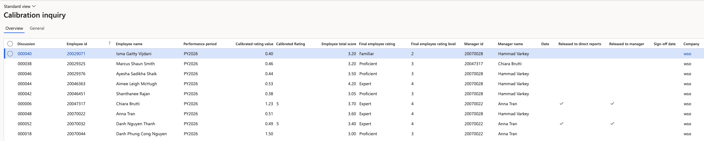
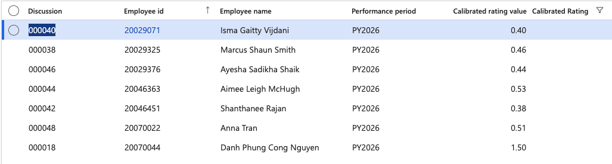

# Monitor the calibration inquiry

When managers submit end-of-year reviews for calibration, each record lands in the calibration inquiry. It is the central list HR uses to see how many records are waiting, what ratings they came in with, and how far along each one is in the release process.

This form reports on calibration — the calibration itself is done from the HR view in ESS.

1. Open the calibration inquiry

   In D365, open the calibration inquiry under **Human Resources ▸ Performance ▸ Calibration inquiry**.

   

2. Filter to the performance year

   Filter by **performance year**. Years accumulate as you use the system, so filtering keeps the list to the cycle you are working on.

3. Read the columns

   Each line is one review submitted for calibration:

   | Column | What it tells you |
   |---|---|
   | **Review ID** | The review the record came from |
   | **Employee ID** | The employee being calibrated |
   | **Final employee rating** | The rating the manager gave at the point of submission |
   | **Calibrated rating** | The rating after calibration — blank until the employee has been calibrated |
   | **Manager** | The manager who submitted the review |
   | **Released to manager** | Whether HR has released the calibrated ratings back to the manager |
   | **Released to direct reports** | Whether the manager has published the ratings to their employees |

4. Identify who still needs calibrating

   A blank **calibrated rating** means that employee has not been calibrated yet. Filtering on blanks gives you the outstanding list.

   

HR carries out calibration in ESS, HR view, where ratings are shown against the expected curve and can be adjusted — see [Calibrate performance ratings](https://github.com/tmrw-education/help/blob/main/ess/11-Performance/07-calibrate-performance-ratings.md) in the ESS guide.
