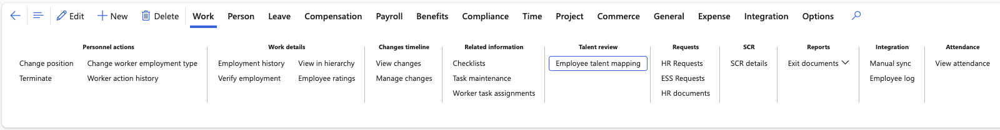
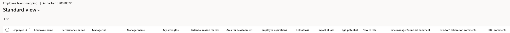

# View talent review records

Talent reviews are completed from the ESS manager view, but the records are stored against the employee in D365. This gives HR a full picture at any point in time without needing the ESS screens.

1. Open the employee record

   In D365, go to **Human Resources ▸ Employees** and open the employee.

2. Go to the talent review

   Go to the **Work** tab and open **Talent review** — also shown as employee talent mapping.

   

3. Read the talent review detail

   The general information holds everything captured against the employee during the talent review:

   | Field | What it holds |
   |---|---|
   | **Comments** | The free-text notes recorded by HR or the manager |
   | **Risk of loss** | How likely the employee is to leave |
   | **Impact of loss** | The effect on the organisation if they did |
   | **Position** | The employee's placement on the growth and performance matrix — key performer, high potential, or neutral |
   | **Identified successor** | The person identified to succeed them |
   | **Employee readiness** | How long until the successor is ready — for example, two years |

   Every comment entered over time is visible here, so you can read the history rather than just the latest entry.

   

4. Open the attachments

   Click the **Attachment** button at the top of the record. Any file uploaded with the talent review in ESS is stored against the employee here.

   

5. Check a matrix move has landed

   When an employee is moved between boxes on the growth and performance matrix in ESS, the new position is written to this record. If a move does not appear straight away, allow a moment and refresh — the update is not instant.

The matrix itself is configured in D365 — see [Configure the growth and performance matrix](./05-configure-the-growth-and-performance-matrix.md).
