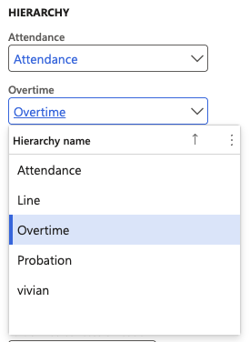
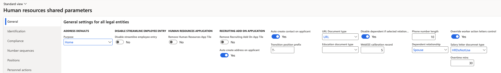

# Configure time and attendance parameters

Two parameter settings drive the whole time and attendance process: the hierarchies that decide who approves attendance and overtime, and the threshold below which overtime is not worth raising. Set both before you load any attendance data.

1. Open the human resource parameters

   In D365, go to **Human Resources ▸ Setup ▸ Human resources parameters** and open the **General** tab.

2. Set the attendance and overtime hierarchies

   In the hierarchy area, you will find two fields — one for **Attendance** and one for **Overtime**. Select the position hierarchy you want each to use.

   

   These exist because the person who approves attendance is not always the line manager. If a separate designated employee handles attendance or overtime, the hierarchy you select here routes it, and you assign individuals to that hierarchy based on their position. If the line manager approves attendance and overtime, you can point both fields to the line hierarchy—there is no problem with that.

3. Save the parameters

   Click **Save**.

4. Set the minimum overtime threshold

   Go to **Human Resources ▸ Setup ▸ Human resources shared parameters** and enter the minimum number of minutes to treat as overtime.

   Anything below the value you enter here will not show up as overtime. This keeps trivial daily overruns—five minutes past the end of a shift, for example—out of the overtime forms so approvers see only overtime that matters.

   

5. Save the shared parameters

   Click **Save**. The threshold applies from the next run of the attendance summary batch job.

Next, put people into those hierarchies — see [Assign attendance and overtime managers to a position](./02-assign-attendance-and-overtime-managers-to-a-position.md).
